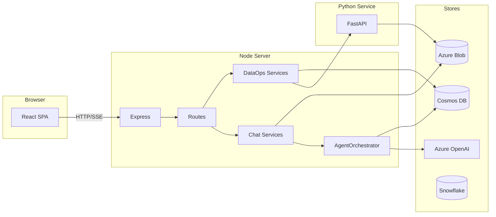
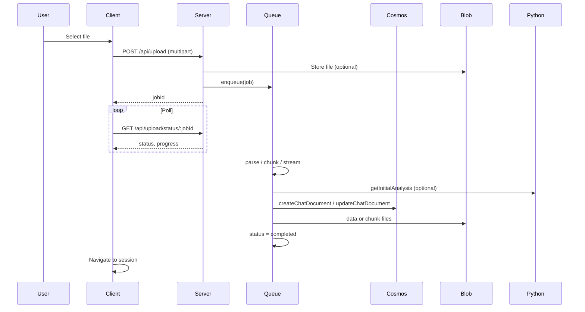

# InsightingTool-RAG: Developer Codebase Guide

A comprehensive guide for developers who need to understand, maintain, and improve the Marico Insight application (InsightingTool-RAG). This document covers setup in a fresh environment, architecture, configuration, frontend and backend implementation, the Python data-ops service, data flows, schemas, security, deployment, testing, and improvement opportunities. The target length is 50,000+ words to support deep understanding without restricting detail.

**Document conventions**

- **Server** means the Node.js/Express application in `server/`.
- **API** means the Vercel serverless entry in `api/` that wraps the server, unless stated otherwise.
- **Client** means the React/Vite single-page application in `client/`.
- **Python service** means the FastAPI application in `python-service/` (and, when deployed on Vercel, the `api/data-ops/` entry that re-exports it).
- File paths are relative to the repository root unless otherwise noted.
- Environment variable names are given in `UPPER_SNAKE_CASE`; values and defaults are described in the Configuration section and in the Setup section below.

---

## Table of Contents

1. [Setup in a Fresh Environment](#1-setup-in-a-fresh-environment)
2. [Introduction and High-Level Architecture](#2-introduction-and-high-level-architecture)
3. [Repository and Project Layout](#3-repository-and-project-layout)
4. [Configuration and Environment](#4-configuration-and-environment)
5. [Frontend (Client) Deep Dive](#5-frontend-client-deep-dive)
6. [Backend (Server) Deep Dive](#6-backend-server-deep-dive)
7. [Python Service](#7-python-service)
8. [Data Flow and Key User Journeys](#8-data-flow-and-key-user-journeys)
9. [Shared Schemas, Types, and Contracts](#9-shared-schemas-types-and-contracts)
10. [Security, CORS, and Authentication](#10-security-cors-and-authentication)
11. [Deployment and Runbooks](#11-deployment-and-runbooks)
12. [Testing, Quality, and Maintainability](#12-testing-quality-and-maintainability)
13. [Improvement Opportunities and Critical Summary](#13-improvement-opportunities-and-critical-summary)
14. [Quick Reference: "Where is…?"](#14-quick-reference-where-is)
15. [Roadmap: Converting to a RAG-Based Application](#15-roadmap-converting-to-a-rag-based-application)

---

## 1. Setup in a Fresh Environment

This section describes how to set up the InsightingTool-RAG codebase from scratch so that you can run the client, the Node server, and the Python data-ops service locally. It also covers optional cloud dependencies (Azure, Cosmos DB, Blob Storage, Snowflake), environment variables, common pitfalls, and minimal vs full setups.

### 1.1 Prerequisites

#### 1.1.1 Required software

- **Node.js**  
  The server and client require Node.js. The codebase does not specify an engine in a root `package.json`; the server uses modern ES modules and `import`/`export`. Use a current LTS version (e.g. Node 18 or 20). To check:

  ```bash
  node --version
  ```

  The server runs with `tsx` in development and compiles with `esbuild` for production; both support ES modules. Ensure `npm` (or your preferred package manager) is available.

- **npm (or yarn/pnpm)**  
  Used to install dependencies for `client/` and `server/`. The following instructions use `npm`; equivalent commands exist for other package managers.

- **Python**  
  The Python data-ops service is required for data operations (preview, summary, transforms, ML). The project pins the runtime in `python-service/runtime.txt` to **Python 3.12.7**. Use that version or a compatible 3.12.x to avoid surprises. To check:

  ```bash
  python --version
  # or, if you use pyenv or a venv:
  python3.12 --version
  ```

  You will need `pip` to install dependencies from `python-service/requirements.txt` (and, if you use Vercel’s Python runtime, `api/data-ops/requirements.txt`).

- **Git**  
  Required to clone the repository and work with branches.

#### 1.1.2 Optional but recommended

- **Azure account**  
  The application is designed to use:
  - **Azure Cosmos DB** for storing chat sessions, dashboards, and sharing metadata.
  - **Azure Blob Storage** for uploaded files, processed data, chart payloads, and chunked data.
  - **Azure OpenAI** for chat completions and (optionally) embeddings.

  Without these, the server will still start, but persistence and AI features will not work. The server logs warnings on startup if Cosmos, Blob, or OpenAI are not configured.

- **Snowflake account (optional)**  
  The “Import from Snowflake” feature requires Snowflake credentials. If you do not set `SNOWFLAKE_*` variables, the server starts normally but Snowflake-related API calls will fail or be disabled.

- **Azure AD / Microsoft Entra ID (optional for full auth)**  
  The client uses Microsoft Authentication Library (MSAL) with Azure AD for login. You need an app registration (client ID, tenant ID, redirect URIs) to use login; otherwise you must adjust or bypass the client’s auth checks.

### 1.2 Cloning and repository structure

Clone the repository and open the project root:

```bash
git clone <repository-url> InsightingTool-RAG
cd InsightingTool-RAG
```

There is no single root `package.json`; the repo is a multi-app layout:

- **client/** — React + Vite frontend.
- **server/** — Node.js + Express backend (TypeScript, run with `tsx` or built output).
- **api/** — Vercel serverless entry points: `index.ts` (Node) and `data-ops/` (Python).
- **python-service/** — Standalone FastAPI application for data operations and ML.
- **dist/** — Build output of the server (created when you run `npm run build` in `server/`).

Do not run `npm install` at the root; install dependencies inside each app directory as described below.

### 1.3 Environment variables overview

Before running anything, you need to configure environment variables. The repo does **not** include `.env.example` files; this section and Section 4 (Configuration and Environment) define them.

- **Server**  
  The server loads its environment from **`server/.env`**. The file is loaded by `server/loadEnv.ts` before any other server code (see `server/index.ts`: first import is `./loadEnv.js`). All server env vars (Cosmos, Blob, OpenAI, Snowflake, etc.) are read from `process.env` after that.

- **Client**  
  The client uses Vite’s `import.meta.env`. Only variables prefixed with **`VITE_`** are exposed. Typically you create a **`client/.env`** or **`client/.env.local`** and define `VITE_API_URL`, `VITE_AZURE_CLIENT_ID`, `VITE_AZURE_TENANT_ID`, etc.

- **Python service**  
  The Python service reads from the process environment. You can set variables in the shell before starting the service or use a `.env` file in `python-service/` if you load it (e.g. via `python-dotenv` or your process manager). The code in `python-service/config.py` uses `os.getenv()` with defaults.

- **Vercel**  
  When deploying to Vercel, set environment variables in the Vercel project (Dashboard → Project → Settings → Environment Variables). The API entry `api/index.ts` uses `import 'dotenv/config'`, which in Vercel loads from the project’s env.

Creating a **template** `.env.example` in each of `server/`, `client/`, and `python-service/` is recommended so that new developers know which variables exist and which are required (see Section 4 and Section 13).

### 1.4 Server setup

1. **Navigate to the server directory**

   ```bash
   cd server
   ```

2. **Install dependencies**

   ```bash
   npm install
   ```

   This installs Express, Cosmos DB client, Azure Blob client, OpenAI SDK, Snowflake SDK, Drizzle (used or legacy—see Section 6), DuckDB, multer, dotenv, and dev tools (tsx, esbuild, TypeScript).

3. **Create `server/.env`**

   Create a file named `.env` in the `server/` directory. The following variables are used by the codebase. Required for minimal “run without persistence” are only those needed so the server does not crash; for full functionality you must set Cosmos, Blob, and Azure OpenAI.

   **Cosmos DB (optional but recommended for persistence)**

   ```env
   COSMOS_ENDPOINT=https://<your-account>.documents.azure.com:443/
   COSMOS_KEY=<your-cosmos-primary-key>
   COSMOS_DATABASE_ID=marico-insights
   COSMOS_CONTAINER_ID=chats
   COSMOS_DASHBOARDS_CONTAINER_ID=dashboards
   COSMOS_SHARED_ANALYSES_CONTAINER_ID=shared-analyses
   COSMOS_SHARED_DASHBOARDS_CONTAINER_ID=shared-dashboards
   ```

   If you omit these, the server will log a warning and continue; Cosmos-dependent routes will fail at runtime.

   **Azure Blob Storage (optional but recommended for file/data storage)**

   ```env
   AZURE_STORAGE_ACCOUNT_NAME=<your-storage-account-name>
   AZURE_STORAGE_ACCOUNT_KEY=<your-storage-account-key>
   AZURE_STORAGE_CONTAINER_NAME=maricoinsight
   ```

   **Azure OpenAI (required for chat and AI features)**

   ```env
   AZURE_OPENAI_ENDPOINT=https://<your-resource>.openai.azure.com/
   AZURE_OPENAI_API_KEY=<your-api-key>
   AZURE_OPENAI_API_VERSION=2023-05-15
   AZURE_OPENAI_DEPLOYMENT_NAME=gpt-4o
   ```

   Optional: separate deployment and endpoint for intent/classification and for embeddings (used only if you later enable RAG or intent models):

   ```env
   AZURE_OPENAI_INTENT_MODEL=gpt-4o-mini
   AZURE_OPENAI_EMBEDDING_ENDPOINT=
   AZURE_OPENAI_EMBEDDING_API_KEY=
   AZURE_OPENAI_EMBEDDING_DEPLOYMENT_NAME=text-embedding-3-small
   AZURE_OPENAI_EMBEDDING_API_VERSION=2023-05-15
   ```

   **Snowflake (optional)**

   ```env
   SNOWFLAKE_ACCOUNT=<account_locator>.<region>.aws
   SNOWFLAKE_USERNAME=<username>
   SNOWFLAKE_PASSWORD=<password>
   SNOWFLAKE_WAREHOUSE=<warehouse_name>
   SNOWFLAKE_DATABASE=
   SNOWFLAKE_SCHEMA=
   ```

   The server normalizes `SNOWFLAKE_ACCOUNT` (e.g. strips full URLs). Use the account identifier format expected by the Snowflake SDK (e.g. `zv14667.ap-south-1.aws`), not the full UI URL.

   **Server behaviour and Python service URL**

   ```env
   PORT=3002
   FRONTEND_URL=http://localhost:3000
   PYTHON_SERVICE_URL=http://localhost:8001
   USE_PYTHON_INITIAL_ANALYSIS=true
   ENABLE_SSE_LOGGING=false
   ```

   **Important:** The client’s Vite proxy and the client’s default `API_BASE_URL` in development point to **port 3002**. So for local dev, set **`PORT=3002`** in `server/.env`. If you use the default `PORT=3003` (from code), the client’s proxy to `http://localhost:3002` will not reach the server unless you change the client config to 3003.

   **Vercel**  
  When running on Vercel, the server does not bind to a port; `api/index.ts` sets `process.env.VERCEL = '1'` and exports the result of `createApp()`. So `PORT` is irrelevant for the serverless deployment.

4. **Run the server (development)**

   ```bash
   npm run dev
   ```

   This runs `NODE_ENV=development NODE_OPTIONS='--max-old-space-size=4096' tsx index.ts`. The increased heap helps with large file uploads and in-memory data. You should see “Server running on port 3002” (or whatever `PORT` you set). Cosmos, Blob, and Snowflake are initialized asynchronously; warnings in the log are normal if those env vars are missing.

5. **Build and run (production-like)**

   ```bash
   npm run build
   npm run start
   ```

   This compiles `server/index.ts` with esbuild into `server/dist/index.js` and runs `node dist/index.js` with the same `NODE_OPTIONS`.

### 1.5 Client setup

1. **Navigate to the client directory**

   From the repo root:

   ```bash
   cd client
   ```

2. **Install dependencies**

   ```bash
   npm install
   ```

   This installs React, Vite, Radix UI, TanStack Query, Recharts, MSAL, wouter, axios, zod, Tailwind, and dev dependencies (TypeScript, Vite plugins).

3. **Create `client/.env` or `client/.env.local`**

   The client expects at least:

   ```env
   VITE_API_URL=http://localhost:3002
   ```

   In development, if you omit `VITE_API_URL`, the client uses `http://localhost:3002` when not in production (see `client/src/lib/config.ts`). So for local dev with the server on 3002, you can leave it unset. For production builds, `API_BASE_URL` falls back to `window.location.origin` if `VITE_API_URL` is not set.

   **Azure AD (required for login)**

   The client’s auth layer and `auth/envCheck.ts` expect:

   ```env
   VITE_AZURE_CLIENT_ID=<azure-ad-app-client-id>
   VITE_AZURE_TENANT_ID=<azure-ad-tenant-id>
   VITE_AZURE_REDIRECT_URI=http://localhost:3000
   VITE_AZURE_POST_LOGOUT_REDIRECT_URI=http://localhost:3000
   ```

   If `VITE_AZURE_CLIENT_ID` or `VITE_AZURE_TENANT_ID` is missing, the client logs errors on load (see `auth/envCheck.ts`). For local development, set `VITE_AZURE_REDIRECT_URI` to the URL where the client runs (e.g. `http://localhost:3000`). In Azure AD, register this exact redirect URI for the app.

4. **Run the client (development)**

   ```bash
   npm run dev
   ```

   Vite starts the dev server. By default it runs on **port 3000** (see `client/vite.config.ts`: `server.port: 3000`). The config also defines a proxy: requests to `/api` are forwarded to `http://localhost:3002`. So with the server on 3002 and the client on 3000, the app can call the backend without CORS issues during development.

5. **Build and preview**

   ```bash
   npm run build
   npm run preview
   ```

   This builds the SPA into `client/dist/` and serves it with Vite’s preview server. For production deployment (e.g. Vercel), you typically serve the contents of `client/dist/` as static assets and route all non-file requests to `index.html` (SPA fallback).

### 1.6 Python service setup

1. **Navigate to the Python service directory**

   From the repo root:

   ```bash
   cd python-service
   ```

2. **Create a virtual environment (recommended)**

   Using Python 3.12:

   ```bash
   python3.12 -m venv .venv
   .venv\Scripts\activate
   ```

   On Unix/macOS:

   ```bash
   source .venv/bin/activate
   ```

3. **Install dependencies**

   ```bash
   pip install -r requirements.txt
   ```

   This installs FastAPI, uvicorn, pandas, numpy, pydantic, scikit-learn, matplotlib, seaborn, and python-multipart. Versions are pinned in `python-service/requirements.txt`; the `api/data-ops/requirements.txt` (for Vercel) may differ slightly.

4. **Configure (optional)**

   The service reads configuration from the environment (see `python-service/config.py`). Defaults:

   - Host: `0.0.0.0`
   - Port: `8001`
   - CORS origins: `http://localhost:3000,http://localhost:5173`
   - Request timeout: 300 seconds
   - Max rows: 1,000,000; max preview rows: 10,000

   You can override with env vars: `PYTHON_SERVICE_HOST`, `PYTHON_SERVICE_PORT`, `CORS_ORIGINS`, `REQUEST_TIMEOUT`, `MAX_ROWS`, `MAX_PREVIEW_ROWS`. For local dev, defaults are usually sufficient.

5. **Run the Python service**

   ```bash
   python main.py
   ```

   Or with uvicorn directly:

   ```bash
   uvicorn main:app --host 0.0.0.0 --port 8001 --reload
   ```

   The server listens on port 8001. The Node server calls it via `PYTHON_SERVICE_URL` (default `http://localhost:8001`). If the Python service is not running, data-ops endpoints (preview, summary, transforms, ML) will fail with connection errors.

### 1.7 Running the full stack locally

Recommended order:

1. Start the **Python service** (port 8001).
2. Start the **Node server** (port 3002) so it can reach the Python service and all backends.
3. Start the **client** (port 3000) so it can use the Vite proxy to the server.

From the repo root, using three terminals:

**Terminal 1 – Python**

```bash
cd python-service
.venv\Scripts\activate   # or source .venv/bin/activate
python main.py
```

**Terminal 2 – Server**

```bash
cd server
npm run dev
```

**Terminal 3 – Client**

```bash
cd client
npm run dev
```

Then open `http://localhost:3000` in the browser. You should see the app’s login (or redirect to Azure AD if configured). After login, you can create a new analysis, upload a file or use Snowflake import (if configured), and use chat and data-ops features.

### 1.8 Port and URL summary

| Service        | Default port | Env / config                    | Purpose                          |
|----------------|-------------|----------------------------------|----------------------------------|
| Client (Vite)  | 3000        | `vite.config.ts` `server.port`  | SPA + proxy to API               |
| Node server    | 3003        | `PORT` in `server/.env`         | API; use **3002** to match proxy |
| Python service | 8001        | `PYTHON_SERVICE_PORT` / config  | Data ops and ML                  |

The client’s Vite proxy sends `/api` to `http://localhost:3002`. The client’s `API_BASE_URL` in dev is `http://localhost:3002` when `VITE_API_URL` is unset. So for a seamless local setup, run the server with **PORT=3002**.

### 1.9 Common setup issues

- **Server not reachable / CORS errors**  
  Ensure the server is listening on the port the client uses (3002 if using the default proxy). Ensure `FRONTEND_URL` in `server/.env` includes `http://localhost:3000` (or your client origin). The server’s CORS middleware allows origins from `FRONTEND_URL` and, in development, common localhost ports.

- **Login redirect or “Missing required environment variables”**  
  Set `VITE_AZURE_CLIENT_ID` and `VITE_AZURE_TENANT_ID` in `client/.env`. In Azure AD, add `http://localhost:3000` (and your production origin) as redirect URIs for the app. `VITE_AZURE_REDIRECT_URI` and `VITE_AZURE_POST_LOGOUT_REDIRECT_URI` should match the URL bar when testing (e.g. `http://localhost:3000`).

- **Data-ops or initial analysis fails**  
  Ensure the Python service is running on 8001 and that `PYTHON_SERVICE_URL` in `server/.env` is `http://localhost:8001`. Check the server log for connection errors to the Python service.

- **Upload or Cosmos/Blob errors**  
  Configure Cosmos and Blob in `server/.env`. Without them, creating sessions and storing uploads will fail. The server starts without them but logs warnings.

- **Snowflake “connection failed”**  
  Use the correct `SNOWFLAKE_ACCOUNT` format (e.g. `account.region.aws`). Do not use the full Snowflake URL. Ensure the user has access to the warehouse and, if you set them, database and schema.

- **Out of memory on large uploads**  
  The server uses `NODE_OPTIONS='--max-old-space-size=4096'` (4 GB). For very large files, increase this or rely on the chunking/streaming pipeline (see Section 6) which is designed to reduce memory use.

### 1.10 Minimal setup (no Azure / no Snowflake)

If you only want to run the stack without persistence or AI:

1. **Server**  
   Create `server/.env` with at least:
   - `PORT=3002`
   - `FRONTEND_URL=http://localhost:3000`
   - `PYTHON_SERVICE_URL=http://localhost:8001`  
   Leave Cosmos, Blob, and OpenAI unset. The server will start; Cosmos/Blob/OpenAI-dependent routes will fail when called. You can still test client routing and static UI.

2. **Client**  
   Set `VITE_API_URL=http://localhost:3002`. For login you still need Azure AD vars, or you must temporarily bypass the auth check (e.g. mock `AuthContext` or comment out the protected route) for local UI testing.

3. **Python service**  
   Run as above. It has no dependency on Azure or Snowflake; it only needs the env (or defaults) in `config.py`.

### 1.11 Detailed setup walkthrough (step-by-step)

The following is a minimal step-by-step sequence that assumes a clean machine and that you have Node.js, Python 3.12, and Git installed.

**Step 1: Clone and open the repo**

```bash
git clone <your-repo-url> InsightingTool-RAG
cd InsightingTool-RAG
```

**Step 2: Server**

```bash
cd server
npm install
```

Create `server/.env` with at least:

- `PORT=3002`
- `FRONTEND_URL=http://localhost:3000`
- `PYTHON_SERVICE_URL=http://localhost:8001`

For full functionality add Cosmos, Blob, and Azure OpenAI variables (see 1.4). Do not start the server yet if you want to start the Python service first.

**Step 3: Python service**

Open a new terminal:

```bash
cd InsightingTool-RAG/python-service
python -m venv .venv
# Windows:   .venv\Scripts\activate
# macOS/Linux: source .venv/bin/activate
pip install -r requirements.txt
python main.py
```

Leave this running. You should see the FastAPI app listening on port 8001.

**Step 4: Start the server**

In the first terminal (or another):

```bash
cd InsightingTool-RAG/server
npm run dev
```

You should see "Server running on port 3002" (or the port you set). Warnings about Cosmos/Blob/Snowflake are expected if those are not configured.

**Step 5: Client**

Open a third terminal:

```bash
cd InsightingTool-RAG/client
npm install
```

Create `client/.env` with:

- `VITE_API_URL=http://localhost:3002`
- `VITE_AZURE_CLIENT_ID=<your-app-client-id>`
- `VITE_AZURE_TENANT_ID=<your-tenant-id>`
- `VITE_AZURE_REDIRECT_URI=http://localhost:3000`
- `VITE_AZURE_POST_LOGOUT_REDIRECT_URI=http://localhost:3000`

Then:

```bash
npm run dev
```

**Step 6: Verify**

Open a browser to `http://localhost:3000`. You should see the app. If Azure AD is configured, you will be redirected to login; after login you should land on the app. To verify the API: open another tab to `http://localhost:3002/api/health`; you should get `{"status":"OK","message":"Server is running"}`. To verify the Python service: `http://localhost:8001/health` (if it exposes a GET /health) or run a simple POST from the app (e.g. start an analysis and upload a small CSV).

**Troubleshooting**

- **"Cannot GET /"** on the server: The server does not serve the client; the client runs on port 3000 via Vite. Always open `http://localhost:3000`.
- **CORS errors**: Ensure the server is on 3002 and FRONTEND_URL includes `http://localhost:3000`. Restart the server after changing .env.
- **Python connection refused**: Start the Python service before or with the server; ensure no firewall is blocking port 8001.
- **Login loop or "Missing required environment variables"**: Fix VITE_AZURE_CLIENT_ID and VITE_AZURE_TENANT_ID; in Azure AD app registration add `http://localhost:3000` as a redirect URI (Web platform).

### 1.12 Creating `.env.example` files (recommended)

To help future developers, add the following as **templates** (no real secrets):

- **server/.env.example**  
  List all variables from Section 1.4 with placeholder values and short comments (e.g. `COSMOS_ENDPOINT=`, `PORT=3002`).

- **client/.env.example**  
  List `VITE_API_URL`, `VITE_AZURE_CLIENT_ID`, `VITE_AZURE_TENANT_ID`, `VITE_AZURE_REDIRECT_URI`, `VITE_AZURE_POST_LOGOUT_REDIRECT_URI` with example values and comments.

- **python-service/.env.example**  
  List `PYTHON_SERVICE_HOST`, `PYTHON_SERVICE_PORT`, `CORS_ORIGINS`, `REQUEST_TIMEOUT`, `MAX_ROWS`, `MAX_PREVIEW_ROWS` with defaults and comments.

These files should be committed; actual `.env` files should remain in `.gitignore`.

---

This completes the setup section. The following sections (2–14) cover architecture, repository layout, configuration details, frontend and backend implementation, Python service, data flows, schemas, security, deployment, testing, improvements, and a quick “where is…?” reference. The document is structured so you can read it sequentially or jump to a section by name or table of contents.

---

## 2. Introduction and High-Level Architecture

### 2.1 Purpose of this document

This guide is for developers who need to:

- **Set up** the project in a new environment (Section 1).
- **Understand** how the application is structured and how data flows between client, server, and Python service.
- **Locate** where specific behaviour is implemented (Section 14).
- **Safely change or extend** features: chat, data ops, dashboards, sharing, uploads.
- **Improve** code quality, testing, configuration, and deployment.
- **Plan** the transition to a true RAG-based application (Section 15).

**Conventions:** **Server** = Node/Express app in `server/`. **Client** = React/Vite SPA in `client/`. **Python service** = FastAPI app in `python-service/` (and its Vercel entry in `api/data-ops/`). **API** = Vercel serverless entry in `api/index.ts` that exports the Express app, unless we mean "REST API" in general. File paths are relative to the repository root unless stated otherwise.

### 2.2 What the application does (feature breakdown)

**Marico Insight (InsightingTool-RAG)** is a full-stack data analysis and insight application. Below is a breakdown by feature so a developer can map user actions to code paths.

**Data ingestion**

- **File upload**: User selects CSV/Excel in the UI (`client/src/pages/Home/Components/FileUpload.tsx` and related). File is sent via `POST /api/upload` to the server. The server enqueues a job in the in-memory upload queue (`server/utils/uploadQueue.ts`). The job is processed asynchronously: file is parsed (or chunked/streamed for large files), a data summary is created, optionally the Python service is called for initial analysis (chart suggestions), and a chat document is created or updated in Cosmos DB. Raw data and chunk files are stored in Azure Blob. The client polls `GET /api/upload/status/:jobId` until the job completes, then can navigate to the new session.
- **Snowflake import**: User selects database, schema, and table in the UI; the client calls `GET /api/snowflake/databases`, `GET /api/snowflake/schemas`, `GET /api/snowflake/tables`, then `POST /api/snowflake/import`. The server enqueues a Snowflake import job; the worker fetches table data via the Snowflake SDK and runs the same pipeline as for file uploads (summary, Cosmos chat doc, Blob).

**Chat over data**

- User types a message in the analysis view (Home page). The client sends `POST /api/chat/stream` (or non-streaming `POST /api/chat`) with `sessionId`, `message`, and optional `mode`. The server loads the chat document from Cosmos (and, if needed, data from Blob or chunk storage), runs the **AgentOrchestrator** (`server/lib/agents/orchestrator.ts`): intent classification, context retrieval (currently from data summary only — no vector RAG), handler selection (general, comparison, statistical, correlation, data-ops, ML). The selected handler uses Azure OpenAI for text and may call the chart generator or Python service. The response (text, charts, insights) is streamed via Server-Sent Events and persisted to Cosmos. The client consumes the SSE stream and updates the message list; it may also subscribe to `GET /api/chat/:sessionId/stream` for live message sync.

**Data operations**

- When the user is in "data-ops" mode (or the orchestrator routes to the data-ops handler), the server forwards requests to the Python service: aggregate, pivot, derived column, type conversion, null handling, outlier detection/treatment, ML model training. The **data ops orchestrator** (`server/lib/dataOps/dataOpsOrchestrator.ts`) and **dataOpsStream.service** coordinate these calls. Results can be streamed back; the modified dataset can be downloaded via `GET /api/data-ops/download/:sessionId`.

**Dashboards**

- Users create dashboards (name, sheets) and add charts from the analysis view or from the dashboard view. Dashboard definitions (name, sheets, chart specs, layout) are stored in Cosmos in the `dashboards` container. The client uses **DashboardContext** and TanStack Query for CRUD; charts are rendered with Recharts and support filters (see `client/src/lib/chartFilters.ts`).

**Sharing**

- Analyses and dashboards can be shared with other users. The client calls shared-analyses or shared-dashboards API; the server creates invite records in Cosmos (`shared-analyses`, `shared-dashboards` containers). Recipients can list incoming/sent invites and accept or decline.

**Important:** The repository name includes "RAG", but **vector-based RAG is not implemented**. Context for the AI is built from the in-session **data summary** (row count, column names and types, numeric/date column lists) and from **conversation history**. There is no embedding model, no vector store, and no semantic retrieval over chunks. Chunking in this codebase is used for **large-file processing** and **query-time filtered loading** of data, not for retrieval-augmented generation. See Section 6 (contextRetriever) and Section 15 for the path to true RAG.

### 2.3 High-level architecture (components and data flow)

The system has four main runtime components:

1. **Client (React SPA)** — Runs in the browser. Served by Vite in development (port 3000) or as static assets (e.g. from Vercel). All API calls go to `API_BASE_URL` (in dev often `http://localhost:3002`; Vite can proxy `/api` to that port). The client does not talk to the Python service directly; all data-ops and ML go through the Node server.
2. **Server (Node/Express)** — Single entry: `server/index.ts` (or `api/index.ts` on Vercel). It registers all REST and SSE routes under `/api` and `/api/data`. It owns persistence (Cosmos DB for chat/sessions/dashboards/sharing; Azure Blob for files, processed data, charts, chunks), calls Azure OpenAI for chat/completions, calls the Python service for data ops and ML, and (optionally) connects to Snowflake for metadata and import. No direct browser–Python connection.
3. **Python service (FastAPI)** — Standalone process (e.g. port 8001) or Vercel serverless function (`api/data-ops`). Exposes HTTP endpoints for data operations (preview, summary, initial analysis, transforms, outlier detection/treatment) and ML model training. Invoked only by the Node server via `PYTHON_SERVICE_URL`.
4. **External services** — Azure Cosmos DB, Azure Blob Storage, Azure OpenAI, (optional) Snowflake. All are accessed from the Node server; the client never holds credentials.

**Request flow (typical chat):** Browser → Client (React) → HTTP/SSE to Server (`/api/chat/stream`) → Chat controller → Chat stream service → AgentOrchestrator → Context retrieval (data summary) + Handler → OpenAI / Chart generator / Python → Response streamed back → Cosmos (persist messages). **Request flow (data-ops):** Browser → Client → Server (`/api/data-ops/chat/stream`) → Data ops controller/stream service → Data ops orchestrator → HTTP to Python service → Response streamed back.

**Architecture diagram (logical):**



### 2.4 Technology stack (detailed)

| Layer | Technologies | Purpose |
|-------|---------------|---------|
| **Frontend** | React 18, TypeScript | UI components and logic |
| | Vite | Dev server, build, HMR |
| | Wouter | Client-side routing |
| | TanStack Query | Server state, cache, mutations |
| | Radix UI | Accessible primitives (dialogs, selects, etc.) |
| | Recharts | Charts (line, bar, pie, scatter, area) |
| | Framer Motion | Animations |
| | Tailwind CSS | Styling |
| | Azure MSAL (React) | Azure AD login |
| | Axios | HTTP client (REST) |
| | Zod | Schema validation and types |
| **Backend** | Node.js, Express | HTTP API and SSE |
| | TypeScript (tsx in dev, esbuild for build) | Type safety and tooling |
| | Cosmos DB (Azure) | Chat documents, sessions, dashboards, sharing |
| | Azure Blob Storage | Files, processed data, charts, chunks |
| | Azure OpenAI | Chat completions (and optional embeddings — unused for RAG today) |
| | Snowflake SDK | Metadata and table import |
| | Passport (local) | Optional local auth |
| | DuckDB | In-process analytics/sampling where used |
| | multer, xlsx, csv-parse | Upload and file parsing |
| | ws | WebSockets where used |
| **Python** | FastAPI, Uvicorn | Data-ops and ML API |
| | Pydantic | Request/response models |
| | Pandas, NumPy | Data transforms |
| | scikit-learn, matplotlib, seaborn | ML and visualization |
| **Deployment** | Vercel | Client SPA + serverless Node API; optional Python serverless |

### 2.5 Critical note on RAG (current state)

The codebase **does not implement vector-based RAG**. There is no vector store and no semantic retrieval over embeddings. The **context retriever** (`server/lib/agents/contextRetriever.ts`) returns a fixed set of strings derived from the data summary (e.g. "Dataset has N rows and M columns", "Numeric columns: …", "Date columns: …") and a list of "mentioned" columns extracted by string matching from the user question. The **embedding client** is initialized in `server/lib/openai.ts` (`getOpenAIEmbeddingsClient()`) and embedding-related env vars are referenced in `server/lib/agents/models.ts`, but **no code path** calls the embedding API for retrieval. Chunking implemented in `server/lib/chunkingService.ts` is for **splitting large files** and **loading filtered subsets** at query time (e.g. by date range or category); it is not used to build a vector index or to retrieve semantically similar chunks. To make this a true RAG application, you will need to add: embedding of relevant content (e.g. schema, summary, or data chunks), a vector store, and retrieval logic that feeds the orchestrator. Section 15 outlines a concrete plan. Until then, either align the project name with "no RAG" or document clearly that RAG is planned.

---

## 3. Repository and Project Layout

### 3.1 Root structure

Root contains: **client/** (React/Vite frontend), **server/** (Node/Express backend), **api/** (Vercel entries: `index.ts` Node, `data-ops/` Python), **python-service/** (FastAPI app), **dist/** (server build output). No root `package.json`; each app is installed and run from its own directory.

### 3.2 Client (`client/`)

**index.html** — Entry HTML. **src/main.tsx** — React entry. **src/App.tsx** — Auth, Wouter router, lazy-loaded routes, layout. **src/pages/** — Home (analysis/chat), Analysis (session history), Dashboard, Login, Layout, NotFound. **src/components/** — ProtectedRoute, AuthCallback, ErrorBoundary, **ui/** (Radix primitives). **src/lib/** — config, httpClient, queryClient, logger, utils, chartFilters, **api/** (sessions, dashboards, chat, data, snowflake, sharedAnalyses, sharedDashboards). **src/contexts/** — AuthContext. **src/hooks/** — useChatMessagesStream, useEventStream, useSharedAnalyses, useSharedDashboards, use-toast. **src/auth/** — msalConfig, envCheck. **src/shared/** — schema.ts (Zod). **vite.config.ts** — port 3000, proxy `/api` to 3002, aliases, build chunks. **package.json** — dev, build, preview; React, Radix, TanStack Query, Recharts, MSAL, wouter, axios, zod.

### 3.3 Server (`server/`)

**index.ts** — loadEnv first, then createApp (Express, middleware, routes, optional Cosmos/Blob/Snowflake init); when not Vercel, HTTP server on PORT (default 3003; use 3002 for client proxy). **loadEnv.ts** — loads `server/.env`. **routes/** — upload, chat, chatManagement, blobStorage, sessions, dataRetrieval, dashboards, sharedAnalyses, sharedDashboards, dataOps, dataApi, snowflake. **controllers/**, **services/** — Chat (streaming and non-streaming), chatResponse, dataOps (streaming and non-streaming). **lib/** — Cosmos/Blob/Snowflake clients, OpenAI, file parsing, chunking, large-file processing, data analyzer, chart generator, agents (orchestrator, handlers, intent/mode classification, context retriever), data ops orchestrator, Python HTTP client, cache. **models/** — database.config, chat.model, dashboard.model, shared models. **middleware/** — CORS. **utils/** — upload queue, SSE helper. **shared/schema.ts** — Zod schemas. **package.json** — dev (tsx), build (esbuild), start, preview.

### 3.4 API layer (`api/`)

**index.ts** — dotenv, VERCEL=1, createApp from server, export app. **data-ops/index.py** — add python-service to path, import FastAPI app from main, expose as app. **data-ops/requirements.txt** — Python deps for Vercel.

### 3.5 Python service (`python-service/`)

**main.py** — FastAPI app, CORS, all endpoints (health, remove-nulls, preview, summary, initial-analysis, create-derived-column, convert-type, aggregate, pivot, identify/treat outliers, train-model). **config.py** — host, port, CORS, timeouts, row limits from env. **data_operations.py** — pandas implementations. **ml_models.py** — training functions. **requirements.txt**, **runtime.txt**.

### 3.6 Build outputs and ignored paths

**server/dist/** — from `npm run build` in server. **client/dist/** — from `npm run build` in client. **node_modules/** — gitignored. **.env** — gitignored; no .env.example in repo (Section 1 and 4 describe vars).

---

## 4. Configuration and Environment

### 4.1 How configuration is loaded

- **Server**: The first line of `server/index.ts` imports `./loadEnv.js`. `loadEnv.ts` uses Node’s `path` and `fileURLToPath` to resolve the server directory and calls `config({ path: path.join(__dirname, '.env') })` from the `dotenv` package. So **`server/.env`** is loaded before any other server module runs. All server code that reads `process.env` (Cosmos, Blob, OpenAI, Snowflake, PORT, FRONTEND_URL, PYTHON_SERVICE_URL, etc.) sees these values.

- **Client**: The client is built with Vite. Only environment variables prefixed with **`VITE_`** are exposed to the app via `import.meta.env`. There is no dotenv in the client bundle; you set variables in the shell or in a `.env` / `.env.local` file in the `client/` directory, and Vite injects `VITE_*` at build time. At runtime, `client/src/lib/config.ts` and `client/src/auth/msalConfig.ts` read `import.meta.env.VITE_API_URL`, `import.meta.env.VITE_AZURE_CLIENT_ID`, etc.

- **Python service**: `python-service/config.py` uses `os.getenv()` for all settings. There is no dotenv call in the Python code by default; you can set env vars in the shell or use a tool that loads a `.env` file before starting the process (e.g. `python-dotenv` in a wrapper or your process manager).

- **Vercel**: For the serverless API, `api/index.ts` runs `import 'dotenv/config'` at the top. On Vercel, environment variables are configured in the project settings; dotenv will load from the project’s environment, so any variables you set in the Vercel dashboard (e.g. COSMOS_ENDPOINT, AZURE_OPENAI_API_KEY) are available to the Node server.

### 4.2 Server environment variables (reference)

| Variable | Purpose | Default / note |
|----------|---------|----------------|
| COSMOS_ENDPOINT | Cosmos DB endpoint URL | Required for Cosmos |
| COSMOS_KEY | Cosmos DB primary key | Required for Cosmos |
| COSMOS_DATABASE_ID | Database name | `marico-insights` |
| COSMOS_CONTAINER_ID | Chats container | `chats` |
| COSMOS_DASHBOARDS_CONTAINER_ID | Dashboards container | `dashboards` |
| COSMOS_SHARED_ANALYSES_CONTAINER_ID | Shared analyses container | `shared-analyses` |
| COSMOS_SHARED_DASHBOARDS_CONTAINER_ID | Shared dashboards container | `shared-dashboards` |
| AZURE_STORAGE_ACCOUNT_NAME | Blob storage account | Required for Blob |
| AZURE_STORAGE_ACCOUNT_KEY | Blob storage key | Required for Blob |
| AZURE_STORAGE_CONTAINER_NAME | Blob container name | `maricoinsight` |
| AZURE_OPENAI_ENDPOINT | Azure OpenAI endpoint | Required for chat |
| AZURE_OPENAI_API_KEY | Azure OpenAI API key | Required for chat |
| AZURE_OPENAI_API_VERSION | API version | `2023-05-15` |
| AZURE_OPENAI_DEPLOYMENT_NAME | Chat deployment name | e.g. `gpt-4o` |
| AZURE_OPENAI_INTENT_MODEL | Optional intent model | Falls back to deployment name |
| AZURE_OPENAI_EMBEDDING_* | Optional embedding endpoint/key/deployment/version | Not used for RAG in current code |
| SNOWFLAKE_ACCOUNT | Snowflake account identifier | e.g. `account.region.aws` |
| SNOWFLAKE_USERNAME, SNOWFLAKE_PASSWORD, SNOWFLAKE_WAREHOUSE | Snowflake credentials | Optional |
| SNOWFLAKE_DATABASE, SNOWFLAKE_SCHEMA | Optional default DB/schema | |
| PORT | HTTP server port (local only) | `3003` in code; use **3002** for client proxy |
| FRONTEND_URL | Allowed CORS origin | e.g. `http://localhost:3000` |
| PYTHON_SERVICE_URL | Python data-ops service base URL | `http://localhost:8001` |
| USE_PYTHON_INITIAL_ANALYSIS | Use Python for initial analysis on upload | `true` / `false` |
| ENABLE_SSE_LOGGING | Verbose SSE logging | `true` / `false` |
| VERCEL | Set by api/index.ts | `1` on Vercel |

Containers use partition keys: chats `/fsmrora` (username), dashboards `/username`, shared-analyses and shared-dashboards `/targetEmail`. Cosmos is initialized asynchronously on startup; if env vars are missing, the server logs warnings and continues.

### 4.3 Client environment variables (reference)

| Variable | Purpose | Required |
|----------|---------|----------|
| VITE_API_URL | Backend API base URL | No; dev default `http://localhost:3002`, prod uses origin if unset |
| VITE_AZURE_CLIENT_ID | Azure AD app (client) ID | Yes for login (envCheck) |
| VITE_AZURE_TENANT_ID | Azure AD tenant ID | Yes for login |
| VITE_AZURE_REDIRECT_URI | Redirect URI after login | No; defaults to current origin in msalConfig |
| VITE_AZURE_POST_LOGOUT_REDIRECT_URI | Redirect URI after logout | No; defaults to current origin |

`client/src/lib/config.ts` sets `API_BASE_URL` to `import.meta.env.VITE_API_URL` or, in production, `window.location.origin` if unset, or in development `http://localhost:3002`. So for local dev with the default Vite proxy, the client talks to the server at port 3002.

### 4.4 Python service configuration

Defined in `python-service/config.py`: **HOST** (`PYTHON_SERVICE_HOST`, default `0.0.0.0`), **PORT** (`PYTHON_SERVICE_PORT`, default `8001`), **CORS_ORIGINS** (comma-separated, default `http://localhost:3000,http://localhost:5173`), **REQUEST_TIMEOUT** (seconds, default 300), **MAX_ROWS** (default 1,000,000), **MAX_PREVIEW_ROWS** (default 10,000). The Node server calls the service at `PYTHON_SERVICE_URL` (default `http://localhost:8001`).

### 4.5 Gaps and recommendations

The repository does not include `.env.example` files. New developers must infer variables from code or from this guide. Recommended: add `server/.env.example`, `client/.env.example`, and `python-service/.env.example` with placeholder values and short comments, and document required vs optional variables (see Section 1.11).

---

## 5. Frontend (Client) Deep Dive

### 5.1 Entry and routing

The client entry is `client/index.html`, which loads the script that boots Vite; the application code starts at `client/src/main.tsx`, which renders the root React component. The root component tree is wrapped by providers (e.g. MSAL, TanStack Query, AuthContext). `App.tsx` decides whether to show the auth callback handler (when the URL contains `?code` or `?error` from Azure AD redirect) or the main router. Routing uses **Wouter** (not React Router): `Switch` and `Route` components define paths. Main routes: `/history` → Analysis page (session list), `/dashboard` → Dashboard page, `/analysis` → Home page (chat/analysis with `initialMode="general"`). Paths like `/data-ops` and `/modeling` redirect to `/analysis` in a `useEffect`. The 404 route renders a NotFound component. All route content is rendered inside a shared `Layout` that receives `currentPage`, `onNavigate`, `onNewChat`, `onUploadNew`, `sessionId`, and `fileName` so the sidebar and header can reflect the current state and trigger navigation or new analysis. Pages (Home, Analysis, Dashboard, NotFound) are lazy-loaded via `React.lazy` and wrapped in `Suspense` with a loading fallback.

### 5.2 Authentication

Authentication is handled with **Microsoft Authentication Library (MSAL)** for React (`@azure/msal-browser`, `@azure/msal-react`). Configuration is built in `client/src/auth/msalConfig.ts` via `createMsalConfig()`: it uses `VITE_AZURE_CLIENT_ID`, `VITE_AZURE_TENANT_ID`, and optional redirect URIs (defaulting to the current origin). The cache is set to `sessionStorage`. On load, `auth/envCheck.ts` runs `checkEnvironmentVariables()`, which requires `VITE_AZURE_CLIENT_ID` and `VITE_AZURE_TENANT_ID` and logs errors if they are missing. The **AuthContext** (in `contexts/AuthContext.tsx`) uses `useMsal()` to read accounts and in-progress state, sets the current user from the first account, and syncs the user’s email to `client/src/utils/userStorage.ts` (localStorage). Login is performed via `loginRedirect` with scopes `['User.Read']` and prompt `select_account`. Logout clears the user and storage, then calls `logoutRedirect` with the configured post-logout redirect URI. **ProtectedRoute** wraps the main app: if auth is still loading it shows a “Checking authentication…” state; if not authenticated it renders the Login page; otherwise it renders children. So all main routes require an authenticated user. The **AuthCallback** component handles the redirect after Azure AD login: it calls `instance.handleRedirectPromise()` and then lets the AuthContext reflect the new account state.

### 5.3 API communication and client API modules

The client talks to the backend using a dedicated Axios instance defined in `client/src/lib/httpClient.ts`. The base URL is taken from `client/src/lib/config.ts`: `API_BASE_URL` is set to `import.meta.env.VITE_API_URL` if present, otherwise in production to `window.location.origin`, and in development to `http://localhost:3002`. This ensures that in local dev the client hits the same port as the Vite proxy target. The Axios instance is configured with `timeout: 0` (no request timeout), `withCredentials: true` (cookies and credentials sent cross-origin), and a default `Content-Type: application/json` header. Every request is intercepted to add the `X-User-Email` header from `getUserEmail()` (which reads from localStorage via `utils/userStorage.ts`), so the server can associate the request with the logged-in user. Response interceptor: on cancel/abort the error is rethrown as a cancelled request; on CORS/network-style errors the client retries the request once; on HTTP error responses the message is taken from `response.data.error` or `response.data.message` and thrown as a single Error. The module exports `apiRequest`, `api` (object with get, post, put, patch, delete methods), and `uploadFile` for multipart uploads.

**Client API modules** (`client/src/lib/api/`): Each module encapsulates calls to a specific area of the backend. **sessions.ts** — sessions list, paginated/filtered sessions, session details, session statistics, update session (PATCH), update context, delete session, data summary by session. **dashboards.ts** — create dashboard, get all dashboards, get dashboard by id, update dashboard, delete dashboard, add/remove/update charts, add/remove/rename sheets. **chat.ts** — stream chat (POST to /api/chat/stream with body and credentials, consume SSE), data-ops stream (POST to /api/data-ops/chat/stream), download modified dataset. **data.ts** — data retrieval: user sessions, chat by id, session by id, chat statistics, raw data. **snowflake.ts** — list databases, list schemas, list tables, trigger Snowflake import (POST). **sharedAnalyses.ts** — create shared analysis, list incoming/sent, get/accept/decline invite. **sharedDashboards.ts** — same pattern for shared dashboards. **index.ts** re-exports these. All of these use the shared `api`/`apiRequest` or `fetch` with `API_BASE_URL` and send the user identity (header or query) as required by the server.

The instance uses `baseURL: API_BASE_URL` (from config), `timeout: 0`, and `withCredentials: true`. A request interceptor adds `X-User-Email` from userStorage. The response interceptor handles cancel/abort, retries once on CORS/network errors, and normalizes HTTP error messages. For **chat and data-ops streaming**, the client uses native `fetch` in `lib/api/chat.ts` (streamChatRequest, data-ops stream) and consumes SSE. The hook `useChatMessagesStream` uses `EventSource` for `GET /api/chat/:sessionId/stream`. **TanStack Query** (queryClient.ts) uses `apiRequest` as default queryFn and is used for sessions, dashboards, shared lists, and mutations with invalidation.

### 5.4 State management

There is no global store like Redux or Zustand. **React local state** is used in pages and components (e.g. Home, Layout, modals). **TanStack Query** holds server state (sessions, dashboards, shared lists) and is used for mutations with invalidation. **AuthContext** holds the current user and login/logout. **DashboardContext** (in the Dashboard page) holds the list of dashboards, the current dashboard, and actions (create, rename, delete, add/remove sheets, add/remove/update charts and insights) implemented via TanStack Query mutations and refetch. **Persistence**: only the current user email is persisted in localStorage via `userStorage`. URL state is limited to the path (Wouter); there is no query-string state library for filters.

### 5.5 Pages and key flows (detailed)

**Home page** (`client/src/pages/Home/Home.tsx`)

- **Role**: Main analysis and chat view. User either starts a new analysis (upload or Snowflake) or works in an existing session (chat, view charts, add to dashboard).
- **State and hooks**: `useHomeState` holds local state (session id, messages, mode, file name, upload status, etc.). `useHomeMutations` wraps TanStack mutations for upload, Snowflake import, and sending chat messages (streaming and non-streaming). `useSessionLoader` loads a session when the user navigates to a session (e.g. from Analysis history). `useHomeHandlers` provides event handlers that call mutations and update state (e.g. on file drop, on send message, on new analysis).
- **Child components**: **StartAnalysisView** — choice between file upload and Snowflake import. **FileUpload** — dropzone and file picker; on success returns job id for status polling. **SnowflakeImportFlow** — database/schema/table selection and import trigger. **ChatInterface** — message list and input; uses `useChatMessagesStream` for live updates when viewing a session. **MessageBubble** — single message (user/assistant), optional charts and insights; **ChartRenderer** for each chart. **ChartModal** — full view of one chart. **DashboardModal** — add current chart to a dashboard/sheet. **ContextModal** — edit permanent context for the session. **DataSummaryModal** — view data summary (row/column counts, column list). **DataPreviewTable** — tabular preview of data. **ColumnsDisplay** — column list display.
- **Data flow**: Upload/Snowflake → mutation → poll status → on success, session id and data summary are available; user can send messages. Chat message → mutation (POST /api/chat/stream) → SSE consumed in mutation → new message appended to state and optionally persisted via server; `useChatMessagesStream` can push additional messages from the session stream.

**Analysis page** (`client/src/pages/Analysis/Analysis.tsx`)

- **Role**: Session history. List all sessions for the user (with optional filters), load a session into the Home view, delete a session, or share an analysis.
- **Hooks**: `useSessionFilters` — filter state (date range, search, etc.) and filtered session list (from TanStack Query). `useSessionManagement` — delete session, edit session (e.g. rename), invalidate queries after mutations.
- **Components**: **SessionCard** — one session (name, date, preview); actions: load, delete, share. **DeleteSessionDialog** — confirmation for delete. **ShareAnalysisDialog** — invite collaborators, link to dashboards. **AnalysisLoadingState** — loading placeholder.
- **Navigation**: "Load" on a session typically navigates to `/analysis` with session id (and optionally file name) so Home can load that session via `useSessionLoader`.

**Dashboard page** (`client/src/pages/Dashboard/Dashboard.tsx`)

- **Role**: List of dashboards and single-dashboard view with sheets and chart tiles.
- **Context**: **DashboardContext** provides the list of dashboards, current dashboard, and actions (create, rename, delete, add/remove/rename sheets, add/remove/update charts and insights). Implemented via `useDashboardState` (TanStack Query for list and single dashboard, mutations for all writes).
- **Components**: **DashboardList** — list of dashboard names; select one to view. **DashboardView** — selected dashboard: **DashboardTiles** (react-grid-layout grid of tiles), **ResizableTile** per chart, **ChartContainer** (chart + filters + actions), **ChartOnlyModal** (full-screen chart), **DashboardFilters** (dashboard-level filters), **ShareDashboardDialog**, **SharedDashboardsPanel**, **DeleteDashboardDialog**, **EditInsightModal**, **DashboardEmptyState**, **InsightRecommendationTile**.
- **Adding charts**: From Home, user clicks "Add to dashboard" on a chart → **DashboardModal** opens → user selects dashboard and sheet → API adds chart to that sheet; Dashboard view refetches.

### 5.6 Components and UI (detailed)

**Global and layout components** (`client/src/components/`)

- **ProtectedRoute** — Wraps the main app content. If auth is loading, shows "Checking authentication…"; if not authenticated, renders the Login page; otherwise renders children. Used in `App.tsx`.
- **AuthCallback** — Rendered when the URL has `?code` or `?error` (Azure AD redirect). Calls `instance.handleRedirectPromise()` and then the app shows the main router; AuthContext updates from MSAL accounts.
- **ErrorBoundary** — React error boundary for catching render errors.
- **LogoutButton**, **UserEmailDisplay** — Use AuthContext for logout and display.
- **AvailableModelsDialog** — Dialog for available models (if used).
- **AnalysisHistory** — Can be used to show history (e.g. in sidebar).
- **FilterAppliedMessage** — Message when filters are applied (e.g. on charts).

**UI primitives** (`client/src/components/ui/`)

- Radix-based: button, input, label, textarea, checkbox, switch, radio-group, slider, toggle, card, alert, badge, skeleton, progress, separator, dialog, alert-dialog, sheet, drawer, popover, tooltip, toast, toaster, select, dropdown-menu, context-menu, scroll-area, table, pagination, breadcrumb, accordion, collapsible, avatar, form, etc. These are the building blocks for all forms and modals.
- **chart.tsx** — Recharts wrapper with theme/config (ChartContext); used by ChartRenderer and dashboard chart components.
- **sidebar.tsx** — Sidebar layout with SidebarContext.
- **markdown-renderer.tsx** — Renders markdown (e.g. in messages).

**Charts and filters**

- **ChartRenderer** (Home): Accepts a `ChartSpec` (type, title, x, y, optional y2, aggregate, data, etc.). Renders the appropriate Recharts chart (Line, Bar, Scatter, Pie, Area, ComposedChart). Uses **lib/chartFilters.ts**: `deriveChartFilterDefinitions` builds filter definitions from the chart data and spec; `applyChartFilters` applies current filter values to the data. When `enableFilters` is true, shows a filter UI (e.g. popover) so the user can narrow by category, date range, or numeric range. Supports "add to dashboard" via DashboardModal.
- **ChartContainer** (Dashboard): Wraps a chart in the dashboard grid with the same filter logic and actions (e.g. full-screen, edit insight).
- **lib/chartFilters.ts**: Defines filter types (categorical, date, numeric), `applyChartFilters`, `deriveChartFilterDefinitions`, `hasActiveFilters`, and related helpers so the same logic applies in Home and Dashboard.

### 5.7 Shared types and schemas (client)

`client/src/shared/schema.ts` defines Zod schemas and inferred types: `ChartSpec`, `Message`, `Insight`, `ThinkingStep`, `DataSummary`, column statistics, etc. These align with the server’s response shapes; the server has a parallel `server/shared/schema.ts` (see Section 9). Duplication between client and server is a maintainability risk; a single shared package or code generation would reduce drift.

### 5.8 Critical observations (client)

Schema and types are duplicated between client and server. Legacy routes `/data-ops` and `/modeling` redirect to `/analysis`. No shared TypeScript package for API contracts. See Section 13 for improvement suggestions.

---

## 6. Backend (Server) Deep Dive

### 6.1 Application bootstrap

The server is built in `server/index.ts`. The very first import is `./loadEnv.js`, which loads `server/.env` so that all subsequent code sees the correct environment variables. The exported function `createApp()` creates an Express app, applies `express.json({ limit: '1gb' })` and `express.urlencoded({ extended: false, limit: '1gb' })` to support large uploads and chat payloads, then applies CORS via `corsConfig` from `middleware/index.js`, handles `OPTIONS *` with the same CORS config, and registers the health route `GET /api/health` and all other routes via `registerRoutes(app)`. After that, it kicks off optional asynchronous initialization of Cosmos DB, Azure Blob Storage, and Snowflake (each with a catch so missing config only logs warnings). When not running on Vercel (`!process.env.VERCEL`), the file also starts an HTTP server on `PORT` (default 3003) by calling `createServer(app)` and `server.listen(port)`.

### 6.2 Route map and registration order

Routes are registered in **`server/routes/index.ts`**. The order of `app.use()` matters when paths overlap; the file mounts routes as follows:

1. `app.use('/api', uploadRoutes)` — Upload: POST /api/upload, GET /api/upload/status/:jobId, GET /api/upload/queue/stats.
2. `app.use('/api', snowflakeRoutes)` — Snowflake: GET databases, schemas, tables; POST import.
3. `app.use('/api', chatRoutes)` — Chat: POST /api/chat, POST /api/chat/stream, GET /api/chat/:sessionId/stream.
4. `app.use('/api', chatManagementRoutes)` — Chat management: GET/DELETE /api/chats/...
5. `app.use('/api', blobStorageRoutes)` — Blob: GET/POST/DELETE /api/files/...
6. `app.use('/api', sessionRoutes)` — Sessions: GET/PATCH/DELETE /api/sessions/...
7. `app.use('/api/data', dataRetrievalRoutes)` — Data retrieval: GET /api/data/user/:username/sessions, /api/data/chat/:chatId, /api/data/session/:sessionId, etc.
8. `app.use('/api', dashboardRoutes)` — Dashboards: CRUD /api/dashboards/...
9. `app.use('/api', sharedAnalysisRoutes)` — Shared analyses: POST/GET /api/shared-analyses/...
10. `app.use('/api', sharedDashboardRoutes)` — Shared dashboards: POST/GET /api/shared-dashboards/...
11. `app.use('/api', dataOpsRoutes)` — Data ops: GET /api/data-ops/health, POST /api/data-ops/chat, POST /api/data-ops/chat/stream, GET /api/data-ops/download/:sessionId.
12. `app.use('/api/data', dataApiRoutes)` — Data API: GET /api/data/:sessionId/sample, metadata, stats; POST /api/data/:sessionId/query.

Note: `/api/data` is used by both dataRetrievalRoutes and dataApiRoutes; exact path definitions in those route files determine which handler runs (e.g. `/api/data/:sessionId/sample` vs `/api/data/user/:username/sessions`).

**Controller → service mapping (chat and data-ops)**

- **Chat**: `controllers/chatController.ts` → `services/chat/chat.service.ts` (non-streaming) or `services/chat/chatStream.service.ts` (streaming). Both use `lib/dataAnalyzer.ts` and the agent orchestrator; the stream service sends SSE via `utils/sse.helper.ts` and persists messages to Cosmos via `models/chat.model.ts`.
- **Data ops**: `controllers/dataOpsController.ts` → `services/dataOps/dataOps.service.ts` (non-streaming) or `services/dataOps/dataOpsStream.service.ts` (streaming). Both call `lib/dataOps/dataOpsOrchestrator.ts` and `lib/dataOps/pythonService.ts` for HTTP calls to the Python service.
- **Sessions, dashboards, shared analyses/dashboards, upload, blob, Snowflake**: Each has a controller in `controllers/` that calls the corresponding model or lib (e.g. `models/chat.model.ts`, `models/dashboard.model.ts`, `utils/uploadQueue.ts`, `lib/blobStorage.ts`, `lib/snowflakeService.ts`).

### 6.3 Chat and streaming

The chat flow is implemented in **controllers/chatController.ts** and **services/chat/**. For non-streaming: `chatWithAI` validates `sessionId` and `message`, then calls `processChatMessage` (chat.service), which loads the chat from Cosmos by session and username, loads the last 15 messages, optionally extracts columns and samples with DuckDB, calls `answerQuestion` (dataAnalyzer) and `generateAISuggestions`, then persists via `addMessagesBySessionId` / `updateMessageAndTruncate`. For streaming: `chatWithAIStream` validates the body and calls `processStreamChat` (chatStream.service), which loads the chat document and latest data (including from blob if needed), sets SSE headers via `utils/sse.helper.ts`, sends events (e.g. "thinking"), runs the **AgentOrchestrator** (mode classification, handlers), streams the answer and charts, and saves messages to Cosmos. The **streamChatMessagesController** streams existing messages for a session via SSE. **chatResponse.service** handles enriching and validating chart responses and building error responses.

### 6.4 Agent and orchestrator flow

The **AgentOrchestrator** (`server/lib/agents/orchestrator.ts`) is the main entry for processing user queries. It maintains a list of handlers (GeneralHandler, DataOpsHandler, etc.) and implements a fallback chain. For each query it can emit "thinking" steps via a callback. The flow: **intent classification** (intentClassifier), **context resolution** (contextResolver), **context retrieval** (contextRetriever — note: no vector RAG; returns summary-based context), **complex query detection** (complexQueryDetector), optional **clarification** (clarification utility), then routing to the appropriate handler. Handlers extend **BaseHandler** and implement `handle()`: GeneralHandler, DataOpsHandler, ComparisonHandler, StatisticalHandler, CorrelationHandler, ConversationalHandler, MlModelHandler. The orchestrator uses **modeClassifier** for mode (e.g. analysis vs data-ops) and **columnExtractor** / **columnMatcher** for column resolution. Error recovery and fallback suggestions are in `utils/errorRecovery.ts`.

### 6.5 Data analysis and chart generation

**dataAnalyzer.ts** builds context and calls OpenAI for answering questions; it can call the Python service for `getInitialAnalysis` (summary + chart suggestions) when `USE_PYTHON_INITIAL_ANALYSIS` is true. **chartGenerator.ts** and **chartDownsampling** produce chart specs and downsampled data for large series. DuckDB is used for sampling and analytical queries where applicable.

### 6.6 Cosmos DB

Cosmos is configured in **models/database.config.ts** (endpoint, key, database id, container ids). Containers: **chats** (partition key `/fsmrora` — username), **dashboards** (`/username`), **shared-analyses** (`/targetEmail`), **shared-dashboards** (`/targetEmail`). Initialization is done in `initializeCosmosDB()` with safe container creation (handles serverless and throughput limits). The **chat model** (chat.model.ts) defines the ChatDocument shape: id, username, sessionId, fileName, messages, dataSummary, charts, insights, blobInfo, currentDataBlob, dataVersions, chunkIndexBlob, permanentContext, etc. Large payloads are stored in Blob; Cosmos holds metadata and references. Dashboard and shared models use the dashboards and shared-analyses/shared-dashboards containers.

### 6.7 Azure Blob Storage

**lib/blobStorage.ts** initializes the Blob client from env (account name, key, container name). Uploads: user files under `{username}/{timestamp}/{filename}`; processed data at `{username}/processed/{sessionId}/v{version}.json`; charts via `saveChartsToBlob`; chunk index and chunk files at `chunks/{sessionId}/`. The server uses Blob for download, listing, SAS URL generation, and delete. Chunking service writes and reads chunk index and chunk data from Blob.

### 6.8 Snowflake integration

**lib/snowflakeService.ts** uses the Snowflake SDK with credentials from env. It normalizes the account identifier (strips URL parts). Exposed operations: `listDatabases`, `listSchemas(database)`, `listTablesInSchema(database, schema)`, `fetchTableData(config)` (with a row limit, e.g. 500000), and connection verification. The upload queue can enqueue Snowflake import jobs; the worker fetches table data and runs the same processing pipeline as for file uploads.

### 6.9 Upload pipeline (phases and file references)

**utils/uploadQueue.ts** maintains an in-memory queue of jobs: **max concurrent 3**, **max queue size 50**. Each job has: jobId, sessionId, username, fileName, and either fileBuffer + mimeType + optional blobInfo, or snowflakeImport config. Job status progresses: `pending` → `uploading` → `parsing` → `analyzing` → `saving` → `completed` or `failed`. **30-minute timeout** per job.

**Phase 1 — Obtain raw data**

- **Snowflake path**: Dynamic import of `fetchTableData` from `lib/snowflakeService.js`; call with job.snowflakeImport; result is an array of rows. Then `createDataSummary(data)` and `convertDashToZeroForNumericColumns` (from `lib/fileParser.js`).
- **File path, small**: `parseFile(job.fileBuffer, job.fileName)` from `lib/fileParser.js` (uses xlsx/csv-parse). If size >= 10MB, **chunking path** is tried first: `chunkFile` from `lib/chunkingService.js` — parse once for summary, then chunk to Blob (`chunks/{sessionId}/`), build chunk index; then either load all chunks or a sampled subset (e.g. max 100k rows for AI) via `loadChunkData`. If chunking fails, fallback to standard or large-file path.
- **File path, large (no chunking)**: `processLargeFile` from `lib/largeFileProcessor.js` — streaming parse, columnar storage; then `getDataForAnalysis(sessionId)` to load data for initial analysis.
- **File path, standard**: Parse in memory, createDataSummary, convertDashToZeroForNumericColumns.

**Phase 2 — Summary and optional initial analysis**

- Summary is from `createDataSummary` (rowCount, columnCount, columns with name/type/sampleValues, numericColumns, dateColumns). If **USE_PYTHON_INITIAL_ANALYSIS** is true and Python service is healthy, `getInitialAnalysis` is called (Python: summary + rule-based chart suggestions). Otherwise or on failure, local logic can be used.

**Phase 3 — Persist**

- **createChatDocument** or **updateChatDocument** (from `models/chat.model.js`): write to Cosmos (chats container, partition by username). Document includes sessionId, fileName, dataSummary, messages (initial or empty), blobInfo, currentDataBlob, chunkIndexBlob (if chunked), etc. Large payloads (full raw data, big chart payloads) are stored in Blob; Cosmos holds references. **saveChartsToBlob** is used when chart payloads are large. Query cache is invalidated for the session.

**Client interaction**: Client posts to `POST /api/upload` (or Snowflake import); server returns jobId. Client polls `GET /api/upload/status/:jobId` until status is completed or failed; then navigates to the session or shows error.

### 6.10 Data ops orchestration

The server calls the Python service via **lib/dataOps/pythonService.ts** (HTTP client with `PYTHON_SERVICE_URL`, timeout 5 minutes). Used endpoints: health, remove-nulls, preview, summary, initial-analysis, create-derived-column, convert-type, aggregate, pivot, identify-outliers, treat-outliers, train-model. The **dataOpsOrchestrator** and **dataOpsController** / **dataOpsStream.service** use these for data-ops chat and streaming; **analyticalQueryEngine** and **dataAnalyzer** also call the Python service where needed. The download of the modified dataset is served via `GET /api/data-ops/download/:sessionId`.

### 6.11 CORS and middleware

**middleware/cors.ts** defines `corsConfig`: origin is validated against a list that includes localhost ports 3000–3004, `FRONTEND_URL`, `.vercel.app`, `.onrender.com`, and any origin containing "localhost". Credentials are allowed; methods include GET, POST, PUT, DELETE, OPTIONS, PATCH; allowed headers include Content-Type, Authorization, X-User-Email, X-User-Name, etc. The server uses no other global middleware beyond body parsers and CORS.

### 6.12 Drizzle and database access

The server **package.json** includes `drizzle-orm` and `drizzle-kit`. The codebase uses **Cosmos DB** directly via the Azure Cosmos SDK (containers, items, queries). There is no Drizzle schema or Cosmos provider in the code paths explored; Drizzle may be legacy or used in a different flow. If unused, removing it would avoid confusion.

### 6.13 Logging and errors

SSE logging can be enabled with `ENABLE_SSE_LOGGING=true`; the SSE helper and shared-analysis stream log events in development or when this flag is set. The server does not use a structured request-id or centralized request logger. Errors are returned as JSON or as SSE error events; the client normalizes them in the Axios response interceptor.

### 6.14 Critical observations (server)

RAG/vector retrieval is not implemented; context is from data summary only. Chunking is for file processing and filtered loading, not for semantic search. Upload queue is in-memory (not durable across restarts). Schema and types are duplicated with the client. See Section 13 for recommendations.

---

## 7. Python Service

### 7.1 Role and deployment

The Python service provides **data operations** (preview, summary, transforms, outlier detection/treatment) and **ML model training**. It runs as a standalone FastAPI app in **python-service/** with four main modules:

- **main.py** — FastAPI app instance, CORS middleware, and all HTTP route handlers. Request/response are defined with Pydantic models in main.py; handlers call into data_operations or ml_models.
- **config.py** — Reads configuration from environment: HOST, PORT, CORS_ORIGINS, REQUEST_TIMEOUT, MAX_ROWS, MAX_PREVIEW_ROWS. Defaults: host 0.0.0.0, port 8001, CORS "http://localhost:3000,http://localhost:5173", timeout 300s, max rows 1M, max preview rows 10k.
- **data_operations.py** — Pure Python/pandas implementations: remove_nulls, get_preview, get_summary, suggest_initial_charts, convert_type, create_derived_column, aggregate_data, pivot_table, identify_outliers, treat_outliers. Includes column type detection (ID, price, percentage, boolean, date) and semantic aggregation hints.
- **ml_models.py** — Training functions for regression (linear, ridge, lasso, RF, XGBoost, etc.), classification (logistic, Naive Bayes, LDA), clustering (KMeans, DBSCAN, hierarchical), dimensionality (PCA, t-SNE, UMAP), time series (ARIMA, exponential smoothing, LSTM, GRU), anomaly (isolation forest, one-class SVM, LOF), and others. All invoked from the single **POST /train-model** endpoint with a `model_type` (or similar) parameter.

**Deployment**: Locally, run `python main.py` or `uvicorn main:app --host 0.0.0.0 --port 8001`. On Vercel, **api/data-ops/index.py** adds the `python-service` directory to `sys.path`, imports `app` from `main`, and exposes it as `app` for the ASGI runtime. The Node server always calls the service over HTTP at **PYTHON_SERVICE_URL** (default `http://localhost:8001`); the browser never talks to the Python service directly.

### 7.2 Endpoints and request/response shapes

| Method | Path | Request body (key fields) | Response (key fields) |
|--------|------|----------------------------|------------------------|
| GET | /health | — | Health status |
| POST | /remove-nulls | data (rows), column?, method (delete/mean/median/mode/custom), custom_value? | data (rows after treatment) |
| POST | /preview | data, limit (default 50, max 10k) | data (first N rows) |
| POST | /summary | data | summary: [{ variable, datatype, total_values, null_values, mean, median, std_dev, min, max, mode }] |
| POST | /initial-analysis | data | summary + chart suggestions (type, title, x, y, aggregate, etc.) |
| POST | /create-derived-column | data, column_name, expression | data (with new column) |
| POST | /convert-type | data, column, target_type | data (column converted) |
| POST | /aggregate | data, group_by[], aggregations[] | aggregated rows |
| POST | /pivot | data, index, columns, values, aggfunc | pivot table (rows) |
| POST | /identify-outliers | data, column, method (iqr/zscore/isolation_forest/lof) | outlier indices or flags |
| POST | /treat-outliers | data, column, method (remove/cap/winsorize/…) | data (treated) |
| POST | /train-model | data, model_type, target?, features?, options | model info, metrics, optional predictions |

Data is always sent as an array of row objects (list of dicts). The Node client in **server/lib/dataOps/pythonService.ts** sends and receives JSON with **snake_case** keys to match Python. Response types are defined as TypeScript interfaces in that file (e.g. RemoveNullsResponse, SummaryResponse, InitialAnalysisResponse, ChartSuggestion).

### 7.3 How the Node server calls the Python service

- **HTTP client**: A single `fetch`-based client (Node 18+ global fetch) with base URL `process.env.PYTHON_SERVICE_URL || 'http://localhost:8001'` and a **5-minute timeout** for long-running calls (e.g. train-model).
- **Call sites**: (1) **dataOpsOrchestrator** and **dataOpsController** / **dataOpsStream.service** — for data-ops chat and streaming (aggregate, pivot, derived column, etc.). (2) **lib/analyticalQueryEngine.ts** — health check and dynamic use of aggregateData, createPivotTable, createDerivedColumn. (3) **lib/dataAnalyzer.ts** — getInitialAnalysis for chart suggestions when USE_PYTHON_INITIAL_ANALYSIS is true. (4) **lib/agents/handlers/mlModelHandler.ts** — trainMLModel. (5) **controllers/sessionController.ts** — getDataSummary. (6) **utils/uploadQueue.ts** — checkPythonServiceHealth and getDataSummary (or getInitialAnalysis) during upload processing.
- **Errors**: If the Python service is down or returns an error, the Node caller receives an HTTP error or timeout; the controller or service surfaces it to the client (e.g. as an error message in the stream or a 502). There is no retry logic in the Python client by default.

### 7.4 Node–Python contract and alignment

There is **no shared OpenAPI spec** and no code generation. The Node client defines TypeScript interfaces for every request and response; the Python side uses Pydantic models (in main.py) and dicts returned by data_operations/ml_models. Conventions: (1) JSON body and query use **snake_case**. (2) Chart suggestions from Python match the **ChartSpec**-like shape expected by the server (type, title, x, y, aggregate). (3) Summary from Python matches the **SummaryResponse** structure used in the orchestrator and upload pipeline. Adding an OpenAPI spec (e.g. from FastAPI’s built-in schema) and generating TypeScript types or validating responses would reduce drift and ease debugging.

### 7.5 Critical observations (Python)

Contract is duplicated between Node and Python; changes to one side can break the other without compile-time checks. No formal API versioning or deprecation. See Section 13 for recommendations. Section 15 (RAG) does not require Python changes for the initial RAG implementation; RAG is implemented on the Node side (embeddings, vector store, retrieval).

---

## 8. Data Flow and Key User Journeys

This section walks through each major user journey with **step-by-step flow**, **file references**, and **state changes** so a developer can trace behaviour end-to-end.

### 8.1 Upload a file (step-by-step)

1. **Client**: User drops or selects a file. Component: `client/src/pages/Home/Components/FileUpload.tsx` (or equivalent). Handler calls upload mutation (e.g. from `useHomeMutations`) which uses `uploadFile` from `client/src/lib/httpClient.ts` or the upload helper from `client/src/lib/api/` to send `POST /api/upload` with multipart form data (file + sessionId + username). Server returns `{ jobId }`.
2. **Client**: Store jobId and start polling. Poll `GET /api/upload/status/:jobId` (e.g. every 1–2 seconds) until `status === 'completed'` or `'failed'`. On completion, response may include sessionId, dataSummary; client can navigate to `/analysis` with that session or update local state so the user can chat.
3. **Server — route**: `server/routes/upload.ts` → `controllers/uploadController.ts` (POST handler). Controller creates session if needed, uploads file to Blob if configured, then calls `uploadQueue.enqueue(sessionId, username, fileName, buffer, mimeType, blobInfo)` from `server/utils/uploadQueue.ts`. Returns jobId.
4. **Server — queue**: `uploadQueue.processNext()` picks the job; `processJob(job)` runs (see Section 6.9). Phases: obtain raw data (parse or chunk or stream), create data summary, optionally call Python `getInitialAnalysis`, create/update chat document in Cosmos, write data/chunks to Blob, update job status to completed/failed.
5. **Persistence**: Cosmos chat document created/updated via `models/chat.model.ts` (createChatDocument/updateChatDocument). Blob paths: user file at `{username}/{timestamp}/{filename}`; chunks at `chunks/{sessionId}/index.json` and `chunks/{sessionId}/chunk_*.json` if chunking was used.

**Flow diagram (upload):**



### 8.2 Snowflake import (step-by-step)

1. **Client**: User selects database (from `GET /api/snowflake/databases`), then schema (from `GET /api/snowflake/schemas`), then table (from `GET /api/snowflake/tables`). Then user triggers import; client sends `POST /api/snowflake/import` with body containing sessionId, username, fileName (e.g. table name), and Snowflake connection config (database, schema, table, and optionally account, username, password, warehouse). Server returns jobId.
2. **Server**: Same upload queue is used. `uploadQueue.enqueueSnowflakeImport(sessionId, username, fileName, snowflakeImport)` adds a job with `snowflakeImport` set and no fileBuffer. Worker in `processJob` detects Snowflake path, calls `fetchTableData(snowflakeImport)` from `lib/snowflakeService.ts`, then runs the same pipeline as file upload: createDataSummary, optional Python initial analysis, createChatDocument/updateChatDocument, store data in Blob if needed. Client polls status the same way as file upload.

### 8.3 Send a chat message (step-by-step)

1. **Client**: User types a message and sends. Client calls stream mutation (e.g. POST to `/api/chat/stream`) with body: `{ sessionId, message, mode? }`. Request includes credentials and `X-User-Email` header. Client opens the response as a stream and parses SSE events (e.g. "thinking", "message", "chart", "done").
2. **Server — controller**: `controllers/chatController.ts` → `chatWithAIStream`. Validates sessionId and message, reads username from header or body, calls `processStreamChat` from `services/chat/chatStream.service.ts`.
3. **Server — stream service**: Loads chat document from Cosmos (by sessionId and username). Loads latest data: if chat has blob refs or chunk index, fetches from Blob or chunking service; otherwise uses in-memory data from document. Sets SSE headers via `utils/sse.helper.ts`. Optionally sends "thinking" events. Calls **AgentOrchestrator** with question, chatHistory, data, summary, sessionId, mode, permanentContext.
4. **Server — orchestrator**: `lib/agents/orchestrator.ts` — `processQuery`. Runs intent classification (`intentClassifier`), context resolution (`contextResolver`), **context retrieval** (`contextRetriever` — currently returns only data-summary-based context, no vector RAG), complex query detection, optional clarification, then selects handler (general, dataOps, comparison, statistical, correlation, conversational, mlModel). Handler runs (e.g. calls OpenAI, chart generator, or Python service). Orchestrator returns answer, charts, insights, etc.
5. **Server — stream service (continued)**: Sends SSE events for the answer and charts; persists user message and assistant message to Cosmos via `addMessagesBySessionId` / chat model updates.
6. **Client**: Appends the new assistant message (and charts) to local state and updates the UI. If the client also subscribes to `GET /api/chat/:sessionId/stream` (e.g. via `useChatMessagesStream`), it can receive additional events for the same session (e.g. for multi-device sync).

### 8.4 Data-ops flow (step-by-step)

1. **Client**: User is in data-ops mode (or asks a data-ops-style question). Client sends `POST /api/data-ops/chat/stream` with sessionId, message, and any mode/context. Same SSE consumption pattern as chat.
2. **Server**: `controllers/dataOpsController.ts` → data-ops stream service. Service loads session and data, then calls **dataOpsOrchestrator** (in `lib/dataOps/dataOpsOrchestrator.ts`). Orchestrator parses the user intent (e.g. "aggregate Sales by Region") and calls the Python service: e.g. `aggregateData`, `createPivotTable`, `createDerivedColumn`. Python returns result rows or summary; orchestrator formats and streams the response. Modified dataset is stored (e.g. as a new version in Blob); session document is updated with currentDataBlob or data version reference.
3. **Download**: User can request the modified dataset. Client calls `GET /api/data-ops/download/:sessionId`. Server looks up the current data version for the session, fetches from Blob if needed, and returns the file (e.g. JSON or CSV).

### 8.5 Dashboards and sharing

**Dashboards**: Client uses TanStack Query to fetch `GET /api/dashboards` (list) and `GET /api/dashboards/:id` (single). Create: `POST /api/dashboards`. Update chart/sheet: `PATCH /api/dashboards/:id/charts/...` or sheets. Delete: `DELETE /api/dashboards/:id`. All persistence is in Cosmos (`dashboards` container, partition by username). Adding a chart from the Home page uses `POST /api/dashboards/:dashboardId/charts` with the chart spec; the server appends to the dashboard’s sheet.

**Sharing**: **Shared analyses**: Client calls `POST /api/shared-analyses` with target email(s), session id, optional message. Server creates a document in `shared-analyses` container (partition by targetEmail). Recipient fetches `GET /api/shared-analyses/incoming`, then `GET /api/shared-analyses/:inviteId`; accept or decline via POST. **Shared dashboards**: Same pattern with `shared-dashboards` routes and container. Incoming lists can be consumed via SSE for real-time updates (`GET /api/shared-analyses/incoming/stream`, etc.).

---

## 9. Shared Schemas, Types, and Contracts

**server/shared/schema.ts** and **client/src/shared/schema.ts** define Zod schemas: ChartSpec, Message, Insight, ThinkingStep, DataSummary, column statistics, etc. The server uses its schema for validation and response shaping; the client uses it for types and parsing. There are small differences (e.g. Message on server may include preview/summary for data-ops). Node–Python contracts are in **server/lib/dataOps/pythonService.ts** (TypeScript) and Python Pydantic/request bodies. Recommendation: single source of truth (shared package or OpenAPI codegen). See Section 13.

---

## 10. Security, CORS, and Authentication

**Authentication**: Client uses MSAL (Azure AD). The server identifies the user via the **X-User-Email** header (and optionally X-User-Name) set by the client from AuthContext/userStorage. There is no backend validation of Azure AD tokens in the code paths reviewed; the server trusts the header. For production, validate the token or use a backend session. **CORS**: Configured in server/middleware/cors.ts; allows listed origins, credentials, and common headers. **Secrets**: All secrets (Cosmos, Blob, OpenAI, Snowflake) are in environment variables; no secrets in repo. Recommend adding backend token/session validation for production.

---

## 11. Deployment and Runbooks

**Local**: Start Python service (8001), then server (3002), then client (3000). Use PORT=3002 for server so client proxy works. **Vercel**: Client uses client/vercel.json (SPA rewrites, asset caching). API is served by api/index.ts (Node serverless). Set all env vars in Vercel project. Python service may be deployed as a separate service or as api/data-ops if routing is configured. **Build**: Client `npm run build` → client/dist. Server `npm run build` → server/dist. **Production notes**: Upload queue is in-memory; Cosmos/Blob/Snowflake must be available; set PYTHON_SERVICE_URL to the deployed Python service URL if separate.

---

## 12. Testing, Quality, and Maintainability

No test files (`*.test.ts`, `*.test.tsx`, `*_test.py`) were found in the repository. There are no documented test scripts in package.json. **Recommendations**: Add unit tests for orchestrator, handlers, chart filters; integration tests for upload pipeline and chat flow; E2E for critical user journeys; schema/contract tests to catch client–server and Node–Python drift. Use lint and TypeScript strict mode where applicable.

---

## 13. Improvement Opportunities and Critical Summary

- **RAG and naming**: Either rename the project or implement real RAG (embeddings, vector store, retrieval) and document it; currently context is from data summary only.
- **Schema and types**: Introduce a single source of truth (shared npm package or OpenAPI codegen) for client–server and Node–Python contracts.
- **Configuration**: Add .env.example files and document required vs optional variables.
- **Testing**: Add unit, integration, and E2E tests; consider CI for critical paths.
- **Upload queue**: Consider a durable queue for production (e.g. Redis or cloud queue) so jobs survive restarts.
- **Auth**: Add backend validation of Azure AD tokens or use server-side sessions.
- **Python API**: Add OpenAPI spec and versioning; align request/response with Node client.
- **Frontend**: Remove or document legacy routes; consolidate duplicate schema.

---

## 14. Quick Reference: "Where is…?"

| Topic | Location |
|-------|----------|
| Upload handling | server/routes/upload.ts, server/utils/uploadQueue.ts, server/controllers/uploadController.ts |
| Chat streaming | server/services/chat/chatStream.service.ts, server/controllers/chatController.ts, client/lib/api/chat.ts, client/hooks/useChatMessagesStream.ts |
| Context for AI (no RAG) | server/lib/agents/contextRetriever.ts |
| Agent orchestration | server/lib/agents/orchestrator.ts, server/lib/agents/handlers/*.ts |
| Cosmos DB | server/models/database.config.ts, server/models/chat.model.ts, server/models/dashboard.model.ts |
| Blob storage | server/lib/blobStorage.ts |
| Snowflake | server/lib/snowflakeService.ts, server/controllers/snowflakeController.ts |
| Python service client | server/lib/dataOps/pythonService.ts |
| Data ops orchestration | server/lib/dataOps/dataOpsOrchestrator.ts, server/services/dataOps/*.ts |
| Client API calls | client/src/lib/httpClient.ts, client/src/lib/api/*.ts |
| Client config and auth | client/src/lib/config.ts, client/src/auth/msalConfig.ts, client/src/contexts/AuthContext.tsx |
| Shared schemas | server/shared/schema.ts, client/src/shared/schema.ts |
| Chunking (data) | server/lib/chunkingService.ts (file processing and filtered load; not RAG) |
| CORS | server/middleware/cors.ts |
| Env loading (server) | server/loadEnv.ts, server/index.ts (first import) |

---

## 15. Roadmap: Converting to a RAG-Based Application

This section is a **plan** for converting the current application into a true **Retrieval-Augmented Generation (RAG)** system. The codebase is named InsightingTool-RAG but today uses only data-summary and schema as context (see Section 2.5 and Section 6.4). The roadmap below is intended so that any developer can understand what RAG means in this context, what to build, in what order, and how to set it up. **Recommended approach:** First optimize the app and close the critical points listed in Section 13; then implement RAG using this plan.

### 15.1 What “RAG” means in this application

In this codebase, **RAG** means:

- **Retrieve** relevant pieces of information (chunks of schema, data summaries, or representative data) based on the **user’s question** and optionally **session context**, using **vector similarity** (embeddings + vector store).
- **Augment** the prompt (or context) passed to the LLM with those retrieved chunks, so the model can answer with grounding in the actual schema and data.
- **Generate** the reply (and charts/insights) as today, but with better accuracy and relevance because the context is semantically selected rather than a fixed summary.

**Out of scope for this plan:** RAG over external documents (e.g. PDFs or wikis). The focus here is **RAG over the session’s data and schema** (column names, types, sample values, summary stats, and optionally sampled or aggregated rows) so that chat and data-ops answers are better grounded.

### 15.2 Prerequisites: close critical points first

Before implementing RAG, the team plans to **optimize the app and close critical points**. That work should include (from Section 13):

- **Configuration**: Add `.env.example` files for server, client, and Python service so new developers (and RAG-related env) are documented.
- **Schema and types**: Reduce duplication between client and server (and ideally Node–Python) so that new RAG response shapes or context types are defined in one place.
- **Testing**: Add at least minimal unit tests for the orchestrator and context retriever so that swapping in RAG retrieval does not regress behaviour.
- **Auth**: If moving to production, add backend validation of Azure AD tokens (or server-side sessions) so that RAG endpoints are properly secured.
- **Upload queue**: If production requires durability, consider a durable queue (e.g. Redis or cloud queue) so that jobs (and any future “re-index on upload” step) survive restarts.

Closing these makes it safer and easier to add new dependencies (vector store, embedding calls) and new code paths (indexing, retrieval) without compounding technical debt.

### 15.3 RAG components (what to add)

| Component | Purpose | Current state | Target state |
|-----------|---------|---------------|--------------|
| **Embeddings** | Turn text (e.g. column descriptions, summary lines, or chunk text) into vectors | Azure OpenAI embedding client exists in `server/lib/openai.ts` but is **not used** for retrieval | Use embedding API for: (1) indexing: embed schema/summary/chunks per session; (2) retrieval: embed the user question and optionally last N messages |
| **Vector store** | Store and query vectors by similarity | None | Add a vector store: e.g. **Azure AI Search** (index with vector field), **Cosmos DB for MongoDB** or **Cosmos DB with vector search** if available, or a dedicated vector DB (e.g. Pinecone, Weaviate). Per-session or per-document indexing so retrieval is scoped to the current session’s data. |
| **Chunking for RAG** | Split “indexable” content into chunks that get embedded and stored | Current chunking in `chunkingService.ts` is for **file processing and filtered loading**, not for semantic retrieval | Define **RAG chunks**: e.g. one chunk per column (name + type + sample values + summary stats), one chunk per “data summary” paragraph, and optionally chunks of aggregated or sampled rows (e.g. “Region X: sum Sales = Y”). Chunking strategy should be documented (size, overlap, metadata). |
| **Indexing pipeline** | When to build/update the vector index | N/A | Trigger: (1) **On upload/session create**: after data summary (and optional initial analysis) is ready, generate RAG chunks, embed them, and write to the vector store with a session (or document) id. (2) **On data-ops update**: when the user applies a transform and a new “version” of data exists, optionally re-index or add chunks for the new version so retrieval stays current. |
| **Retrieval** | Given a question (and session id), return top-k relevant chunks | `contextRetriever.ts` returns **fixed** summary strings and mentioned columns (no vectors) | Replace or extend: (1) Embed the question (and optionally concatenate with last 1–2 user/assistant messages for context). (2) Query the vector store for the **current session** with the question vector; get top-k chunks (e.g. k=5–10). (3) Optionally merge with “mentioned columns” or other rule-based context. (4) Return combined context to the orchestrator so the prompt builder can inject it into the LLM prompt. |
| **Orchestrator integration** | Use retrieved context in the chat/data-ops flow | Orchestrator calls `retrieveContext` and passes result to handlers | Keep the same interface (`RetrievedContext`: dataChunks, pastQueries, mentionedColumns). **dataChunks** should be filled with the **retrieved RAG chunks** (and optionally the existing summary lines) instead of only the three fixed lines. Handlers and prompt construction already consume dataChunks; no need to change handler signatures if the shape is unchanged. |

### 15.4 Technology choices (vector store and embeddings)

**Embeddings**

- **Recommendation**: Use **Azure OpenAI Embeddings** (e.g. `text-embedding-3-small` or `text-embedding-ada-002`). The codebase already has `getOpenAIEmbeddingsClient()` in `server/lib/openai.ts` and env vars (`AZURE_OPENAI_EMBEDDING_*`). Ensure the deployment exists in Azure and that the embedding dimension is known (e.g. 1536 for ada-002) for the vector store index.
- **Alternative**: Another embedding provider (e.g. OpenAI direct, or open-source model running locally) if the team prefers; then add a small adapter so the rest of the RAG pipeline still receives a `embed(text: string): Promise<number[]>` (or batch) interface.

**Vector store**

- **Option A — Azure AI Search**: Create an index with a vector field (same dimension as the embedding model). Store documents with fields: `sessionId`, `chunkId`, `text`, `vector`, and optional metadata (e.g. column name, chunk type). Use the search API’s vector query to get top-k by similarity. Good for production scale and Azure integration.
- **Option B — Cosmos DB (if vector search is available in your tier)**: Use a container (or a dedicated “vectors” container) with vector index policy. Store one document per chunk (sessionId, chunkId, text, embedding array, metadata). Query with vector similarity. Keeps everything in Cosmos but requires Cosmos support for vector search.
- **Option C — Dedicated vector DB (e.g. Pinecone, Weaviate, Qdrant)**: Offload vector storage and similarity search. Good if you need high throughput or advanced filters; adds an extra service and credentials (e.g. PINECONE_API_KEY). Store sessionId as metadata and filter by it on query.

For a **developer-friendly first implementation**, Option A (Azure AI Search) or a simple **in-memory vector store** (e.g. store vectors in memory per session for a single-node dev environment) can be used to validate the flow; then switch to Azure AI Search or Cosmos for production.

### 15.5 Implementation phases (suggested order)

**Phase 1 — Embedding and retrieval wiring (no persistence)**

- Add a **RAG service** module (e.g. `server/lib/rag/` or extend `server/lib/agents/`): (1) `embed(text: string): Promise<number[]>` using `getOpenAIEmbeddingsClient()`. (2) `retrieve(question: string, sessionId: string, options?: { topK: number }): Promise<RetrievedChunk[]>` that, for now, **does not use a vector store**: e.g. return the same summary-based context as today so behaviour is unchanged. This phase only wires the embedding client and a stub retrieval that matches the current `RetrievedContext` shape.
- Add **feature flag** (e.g. `ENABLE_RAG_RETRIEVAL=false`) so RAG retrieval can be turned on later without code deploy.

**Phase 2 — Chunking and indexing (design + implement)**

- Define **RAG chunk schema**: what is stored per chunk (sessionId, chunkId, text, optional metadata: columnName, type, chunkType: "schema" | "summary" | "sample").
- Implement **chunk builder**: from a session’s `dataSummary` (and optionally a small sample of rows or aggregated stats), produce an array of text chunks. E.g. one chunk per column: `Column "{name}" ({type}): sample values {samples}; stats: min={min}, max={max}, mean={mean}`. Optionally add a “global” chunk: “Dataset has N rows, M columns. Numeric: … Date: …”.
- Implement **indexing**: for each chunk, call `embed(chunk.text)`, then write to the vector store (sessionId, chunkId, text, vector, metadata). Indexing should run **after** upload processing (or after data-ops that changes the dataset) so the index stays in sync. Hook into the upload queue completion callback or the session update path.
- **Vector store**: Implement a small abstraction (e.g. `VectorStore` interface: `upsert(sessionId, chunks)`, `query(sessionId, vector, topK)`). First implementation can be in-memory (Map by sessionId, array of chunks with vectors; similarity = cosine or dot product in JS). Then swap in Azure AI Search or Cosmos when ready.

**Phase 3 — Retrieval integration**

- In **contextRetriever.ts**: when `ENABLE_RAG_RETRIEVAL` is true, call the new RAG service: embed the question (and optionally recent messages), call `retrieve(question, sessionId, { topK: 5 })`, and map the returned chunks to `dataChunks`. Optionally append the existing summary lines so that the model always has basic context even if retrieval returns little. Keep `mentionedColumns` logic if useful.
- Test with a few sessions: upload a file, send questions that refer to specific columns or values, and verify that the prompt includes the retrieved chunks and that answers improve.

**Phase 4 — Production vector store and tuning**

- Replace in-memory (or stub) vector store with **Azure AI Search** (or chosen store). Create the index, configure dimension and field types, implement `upsert` and `query` in the abstraction.
- Add **env vars** (e.g. `AZURE_SEARCH_ENDPOINT`, `AZURE_SEARCH_KEY`, `AZURE_SEARCH_INDEX_NAME`) and document them in `.env.example`.
- Tune **topK**, chunk size, and chunk content (e.g. include more or fewer stats) based on quality and latency. Consider **hybrid** retrieval (vector + keyword) if Azure AI Search is used.

### 15.6 Environment variables for RAG

Document these in `server/.env.example` and in this guide:

| Variable | Purpose | Example |
|----------|---------|---------|
| ENABLE_RAG_RETRIEVAL | Turn on RAG retrieval in contextRetriever | `true` or `false` |
| AZURE_OPENAI_EMBEDDING_ENDPOINT | Azure OpenAI endpoint for embeddings (if different from chat) | Same as AZURE_OPENAI_ENDPOINT |
| AZURE_OPENAI_EMBEDDING_API_KEY | API key for embeddings | Same as AZURE_OPENAI_API_KEY |
| AZURE_OPENAI_EMBEDDING_DEPLOYMENT_NAME | Embedding deployment name | `text-embedding-3-small` |
| AZURE_SEARCH_ENDPOINT | Azure AI Search endpoint (when using Option A) | `https://<name>.search.windows.net` |
| AZURE_SEARCH_KEY | Azure AI Search API key | |
| AZURE_SEARCH_INDEX_NAME | Index name for RAG vectors | `rag-chunks` |
| RAG_TOP_K | Number of chunks to retrieve per query | `5` |
| RAG_CHUNK_MAX_SIZE | Max characters per RAG chunk (for chunking strategy) | `500` |

(If using another vector store, add the corresponding credentials and index name.)

### 15.7 Developer setup for RAG (after implementation)

Once RAG is implemented, a developer setting up the app for the first time should:

1. **Complete standard setup** (Section 1): Node, Python, client, server, Python service, Cosmos, Blob, Azure OpenAI chat.
2. **Create an Azure OpenAI embedding deployment** (if not already): e.g. `text-embedding-3-small` in the same or another Azure OpenAI resource. Note the deployment name and set `AZURE_OPENAI_EMBEDDING_DEPLOYMENT_NAME` (and optional `AZURE_OPENAI_EMBEDDING_ENDPOINT` / `AZURE_OPENAI_EMBEDDING_API_KEY` if different from chat).
3. **Create the vector store** (e.g. Azure AI Search): Create a search service, then an index with a vector field (dimension = embedding size, e.g. 1536). Set `AZURE_SEARCH_ENDPOINT`, `AZURE_SEARCH_KEY`, `AZURE_SEARCH_INDEX_NAME`.
4. **Set RAG flags and tuning**: `ENABLE_RAG_RETRIEVAL=true`, `RAG_TOP_K=5` (or desired value).
5. **Run the app**: Upload a session and send a question. Verify in logs (or via debugging) that chunks are indexed after upload and that retrieval returns chunks for the question. Then verify that the model’s answer uses the retrieved context (e.g. by checking that it refers to the correct columns or values).

### 15.8 Summary and next steps

- **Current state**: No vector RAG; context is fixed data summary + mentioned columns (Section 2.5, Section 6.4).
- **Goal**: Add embedding-based retrieval over session-specific chunks (schema/summary/samples) and feed that into the existing orchestrator so the app becomes a true RAG-based application.
- **Order of work**: (1) Close critical points (Section 13). (2) Implement RAG in phases: embedding + stub retrieval → chunking + indexing + vector store abstraction → integrate retrieval into contextRetriever → production vector store + tuning. (3) Document env vars and add RAG setup to Section 1 (or a dedicated “RAG setup” subsection).
- **Files to add or change**: New: `server/lib/rag/` (or similar) for embed, chunk builder, vector store abstraction, and indexing trigger. Change: `server/lib/agents/contextRetriever.ts` to call RAG retrieval when enabled. Optionally: extend upload queue or session update to trigger indexing. No change required to the Python service or the client for the minimal RAG path; only server-side context construction changes.

