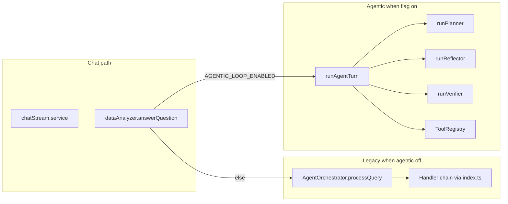

# Agents architecture inventory and multi-agent roadmap

This document is **reference** for developers and AI assistants: it maps where “agents” appear in the RAG-InsightingTool repo and outlines **safe patterns** to grow toward explicit multi-agent collaboration. Optional trace handoffs (`AGENT_INTER_AGENT_MESSAGES`) add structured fields to `AgentTrace` only when enabled; default behavior is unchanged.

**Related design docs**

- Product rollout and RAG invariants: [plans/agentic_only_rag_chat.md](plans/agentic_only_rag_chat.md)
- Agentic loop, verifier/critic, SSE concepts: [plans/agentic_analysis_architecture.md](plans/agentic_analysis_architecture.md)

---

## 1. Executive summary

The codebase uses **two layers**:

1. **Legacy handler orchestrator** — [`AgentOrchestrator`](../server/lib/agents/orchestrator.ts) picks **one** registered handler per query (`processQuery`). Used when the agentic loop flag is **off**.
2. **Agentic plan–act loop** — [`runAgentTurn`](../server/lib/agents/runtime/agentLoop.service.ts) runs a **planner**, **tools**, **reflector**, and **verifier** with budgets and trace. Used when `AGENTIC_LOOP_ENABLED=true`.

Routing is centralized in [`answerQuestion`](../server/lib/dataAnalyzer.ts) via [`isAgenticLoopEnabled()`](../server/lib/agents/runtime/types.ts).

---

## 2. Primary entry points

| Location | Role |
|----------|------|
| [server/lib/dataAnalyzer.ts](../server/lib/dataAnalyzer.ts) | **`answerQuestion`**: if agentic → `runAgentTurn`; else information-seeking shortcut (when applicable), then **`getInitializedOrchestrator().processQuery`** |
| [server/services/chat/chatStream.service.ts](../server/services/chat/chatStream.service.ts) | Streaming chat: mode classification, schema binding, agentic checks, SSE → workbench |
| [server/services/chat/chat.service.ts](../server/services/chat/chat.service.ts) | Non-stream paths: intent + columns + `isAgenticLoopEnabled` |
| [server/services/chat/answerQuestionContext.ts](../server/services/chat/answerQuestionContext.ts) | Context assembly for `answerQuestion`; agent utilities |
| [server/index.ts](../server/index.ts) | Startup: [`assertAgenticRagConfiguration`](../server/lib/agents/runtime/assertAgenticRag.ts) when agentic + RAG expectations apply |

---

## 3. Legacy orchestrator (handlers)

**Registration** — [server/lib/agents/index.ts](../server/lib/agents/index.ts)

- `initializeAgents()` registers handlers on the singleton orchestrator (order matters): `ConversationalHandler`, `DataOpsHandler`, `MLModelHandler`, `StatisticalHandler`, `ComparisonHandler`, `CorrelationHandler`, `GeneralHandler`.

**Execution** — [server/lib/agents/orchestrator.ts](../server/lib/agents/orchestrator.ts)

- `processQuery()` resolves context, mode (`dataOps` / analysis / modeling), intent, and dispatches to **one** handler.

**Handlers** — [server/lib/agents/handlers/](../server/lib/agents/handlers/)

| File | Purpose |
|------|---------|
| [baseHandler.ts](../server/lib/agents/handlers/baseHandler.ts) | Shared handler contract |
| [conversationalHandler.ts](../server/lib/agents/handlers/conversationalHandler.ts) | Conversational / light Q&A |
| [dataOpsHandler.ts](../server/lib/agents/handlers/dataOpsHandler.ts) | Bridges to Data Ops orchestrator |
| [generalHandler.ts](../server/lib/agents/handlers/generalHandler.ts) | Catch-all; interacts with agentic flags in places |
| [statisticalHandler.ts](../server/lib/agents/handlers/statisticalHandler.ts) | Statistical analysis |
| [comparisonHandler.ts](../server/lib/agents/handlers/comparisonHandler.ts) | Comparisons |
| [correlationHandler.ts](../server/lib/agents/handlers/correlationHandler.ts) | Correlations |
| [mlModelHandler.ts](../server/lib/agents/handlers/mlModelHandler.ts) | ML / modeling |

**Support modules** — [server/lib/agents/](../server/lib/agents/)

| File | Role |
|------|------|
| [intentClassifier.ts](../server/lib/agents/intentClassifier.ts) | Intent for routing |
| [modeClassifier.ts](../server/lib/agents/modeClassifier.ts) | Mode (`analysis` / `dataOps` / `modeling`) |
| [contextResolver.ts](../server/lib/agents/contextResolver.ts) | “That column” style resolution |
| [contextRetriever.ts](../server/lib/agents/contextRetriever.ts) | Retrieval helpers |
| [complexQueryDetector.ts](../server/lib/agents/complexQueryDetector.ts) | Complexity heuristics |
| [models.ts](../server/lib/agents/models.ts) | Model identifiers / config |
| [simpleAnalysisFastPath.ts](../server/lib/agents/simpleAnalysisFastPath.ts) | Fast path vs full loop when agentic (see tests) |

---

## 4. Agentic runtime loop

| File | Role |
|------|------|
| [server/lib/agents/runtime/agentLoop.service.ts](../server/lib/agents/runtime/agentLoop.service.ts) | **`runAgentTurn`**: main loop, budgets, synthesis, SSE callbacks |
| [server/lib/agents/runtime/planner.ts](../server/lib/agents/runtime/planner.ts) | Structured planning (`runPlanner`) |
| [server/lib/agents/runtime/reflector.ts](../server/lib/agents/runtime/reflector.ts) | Post-tool **continue / replan / finish / clarify** |
| [server/lib/agents/runtime/verifier.ts](../server/lib/agents/runtime/verifier.ts) | **Verifier** + `rewriteNarrative` |
| [server/lib/agents/runtime/tools/registerTools.ts](../server/lib/agents/runtime/tools/registerTools.ts) | Default tool registration |
| [server/lib/agents/runtime/toolRegistry.ts](../server/lib/agents/runtime/toolRegistry.ts) | Tool registry types / dispatch |
| [server/lib/agents/runtime/types.ts](../server/lib/agents/runtime/types.ts) | `AgentExecutionContext`, `AgentTrace`, `AgentConfig`, flags |
| [server/lib/agents/runtime/schemas.ts](../server/lib/agents/runtime/schemas.ts) | Zod / JSON schemas for LLM outputs |
| [server/lib/agents/runtime/llmJson.ts](../server/lib/agents/runtime/llmJson.ts) | Structured LLM completion helper |
| [server/lib/agents/runtime/context.ts](../server/lib/agents/runtime/context.ts) | Prompt context summarization |
| [server/lib/agents/runtime/workingMemory.ts](../server/lib/agents/runtime/workingMemory.ts) | Working memory between steps |
| [server/lib/agents/runtime/visualPlanner.ts](../server/lib/agents/runtime/visualPlanner.ts) | Extra chart planning; `AGENT_MAX_EXTRA_CHARTS_PER_TURN` |
| [server/lib/agents/runtime/plannerColumnResolve.ts](../server/lib/agents/runtime/plannerColumnResolve.ts) | Column name resolution for planner |
| [server/lib/agents/runtime/planArgRepairs.ts](../server/lib/agents/runtime/planArgRepairs.ts) | Plan argument repairs |
| [server/lib/agents/runtime/chartProposalValidation.ts](../server/lib/agents/runtime/chartProposalValidation.ts) | Chart proposal validation |
| [server/lib/agents/runtime/buildIntermediateInsight.ts](../server/lib/agents/runtime/buildIntermediateInsight.ts) | Intermediate insights |
| [server/lib/agents/runtime/agentLogger.ts](../server/lib/agents/runtime/agentLogger.ts) | Structured agent logging |
| [server/lib/agents/runtime/interAgentMessages.ts](../server/lib/agents/runtime/interAgentMessages.ts) | Optional `interAgentMessages` on trace (`AGENT_INTER_AGENT_MESSAGES`) |
| [server/lib/agents/runtime/assertAgenticRag.ts](../server/lib/agents/runtime/assertAgenticRag.ts) | Startup RAG assertion |
| [server/lib/agents/runtime/index.ts](../server/lib/agents/runtime/index.ts) | Re-exports `runAgentTurn`, constants |
| [server/lib/agents/runDataOpsFromAgent.ts](../server/lib/agents/runDataOpsFromAgent.ts) | Tool path into Data Ops without `processQuery` |

---

## 5. Chat streaming, session context, and UI

| File | Role |
|------|------|
| [server/services/chat/agentWorkbench.util.ts](../server/services/chat/agentWorkbench.util.ts) | SSE events → `AgentWorkbenchEntry`, size caps, `AGENT_SSE_CRITIC_FINAL_ONLY` |
| [server/services/chat/intermediatePivotPolicy.ts](../server/services/chat/intermediatePivotPolicy.ts) | Intermediate pivot coalescing; `AGENT_INTERMEDIATE_PIVOT_COALESCE` |
| [server/lib/sessionAnalysisContext.ts](../server/lib/sessionAnalysisContext.ts) | Mid-turn session merge; `AgentMidTurnSessionPayload`, trace summary for prompts |

**Shared schema** (message fields)

- [server/shared/schema.ts](../server/shared/schema.ts) and [client/src/shared/schema.ts](../client/src/shared/schema.ts) — `agentWorkbench`, `AgentWorkbenchEntry`, thinking / trace shapes.

**Client**

- [client/src/pages/Home/modules/useHomeMutations.ts](../client/src/pages/Home/modules/useHomeMutations.ts) — live workbench state during stream |
- [client/src/pages/Home/Components/ChatInterface.tsx](../client/src/pages/Home/Components/ChatInterface.tsx) — passes workbench to UI |
- [client/src/pages/Home/Components/MessageBubble.tsx](../client/src/pages/Home/Components/MessageBubble.tsx) — renders workbench / thinking |
- [client/src/pages/Home/Home.tsx](../client/src/pages/Home/Home.tsx) — wires props |
- [client/src/lib/api/chat.ts](../client/src/lib/api/chat.ts) — documents SSE kinds when agentic |

---

## 6. Cross-cutting imports (agent-adjacent)

These modules are used by analysis, charts, or agent tools but are not the full “loop”:

| Area | Example paths |
|------|----------------|
| Column matching | [server/lib/agents/utils/columnMatcher.ts](../server/lib/agents/utils/columnMatcher.ts) — used from chart builders, pivot helpers, `dataTransform`, `fileParser`, etc. |
| Column extraction | [server/lib/agents/utils/columnExtractor.ts](../server/lib/agents/utils/columnExtractor.ts) |
| Schema binding (agentic) | [server/lib/schemaColumnBinding.ts](../server/lib/schemaColumnBinding.ts) |
| Data Ops | [server/lib/dataOps/dataOpsOrchestrator.ts](../server/lib/dataOps/dataOpsOrchestrator.ts) — dynamic imports of `contextResolver` |
| Segment driver tool | [server/lib/segmentDriverAnalysisTool.ts](../server/lib/segmentDriverAnalysisTool.ts) |
| Tests | [server/tests/agent*.ts](../server/tests/), planner/tool/runtime tests |

**Python service** — [python-service/](../python-service/): no agent-specific orchestration in tree (FastAPI data-ops only).

---

## 7. Environment variables (agent-related)

| Variable | Where used | Notes |
|----------|------------|--------|
| `AGENTIC_LOOP_ENABLED` | `types.ts`, docs, tests | Must be `"true"` to enable `runAgentTurn` path |
| `AGENTIC_STRICT` | `types.ts`, `dataAnalyzer.ts` | Deprecated semantics when agentic on (see logs) |
| `AGENTIC_ALLOW_NO_RAG` | `assertAgenticRag.ts` | Tests / local experiments without RAG |
| `AGENT_MAX_STEPS` | `types.ts` | Default 12 |
| `AGENT_MAX_WALL_MS` | `types.ts` | Default 120000 |
| `AGENT_MAX_TOOL_CALLS` | `types.ts` | Default 20 |
| `AGENT_MAX_VERIFIER_ROUNDS_STEP` | `types.ts` | Default 2 |
| `AGENT_MAX_VERIFIER_ROUNDS_FINAL` | `types.ts` | Default 2 |
| `AGENT_MAX_LLM_CALLS` | `types.ts` | Default 40 |
| `AGENT_SAMPLE_ROWS_CAP` | `types.ts` | Default 200 |
| `AGENT_OBSERVATION_MAX_CHARS` | `types.ts` | Default 8000 |
| `AGENT_MAX_EXTRA_CHARTS_PER_TURN` | `visualPlanner.ts` | Default 2 |
| `AGENT_MID_TURN_CONTEXT` | `agentLoop.service.ts` | `"false"` disables mid-turn context hook |
| `AGENT_MID_TURN_CONTEXT_THROTTLE_MS` | `agentLoop.service.ts` | Default 8000 |
| `AGENT_INTERMEDIATE_PIVOT_COALESCE` | `intermediatePivotPolicy.ts` | Pivot SSE coalescing |
| `AGENT_INTER_AGENT_MESSAGES` | `types.ts`, `interAgentMessages.ts`, `agentLoop.service.ts` | When `"true"`, records `AgentTrace.interAgentMessages` (Planner / Verifier / Reflector / Synthesizer / VisualPlanner handoffs); emits SSE `handoff` → workbench kind `handoff` |
| `AGENT_INTER_AGENT_PROMPT_FEEDBACK` | `planner.ts`, `reflector.ts`, `agentLoop.service.ts` | When `"true"` **and** inter-agent messages exist, injects a compact digest into planner + reflector prompts (better replans; more tokens) |
| `AGENT_SSE_CRITIC_FINAL_ONLY` | `agentWorkbench.util.ts` | Show more critic SSE when `0` / `false` |
| `AGENT_VERBOSE_LOGS` | `fileParser.ts` | Verbose logging |

RAG variables when agentic is on are documented in [server/.env.example](../server/.env.example) and [assertAgenticRag.ts](../server/lib/agents/runtime/assertAgenticRag.ts).

---

## 8. Multi-agent roadmap: how specialists can “talk” safely

Today’s agentic path is already **multi-role** (planner, tools, reflector, verifier) inside **one** orchestrating function. The items below mix **implemented** building blocks (flags default off) with **future** work.

### 8.1 Coordinator + message bus — **implemented (trace + SSE)**

- [`runAgentTurn`](../server/lib/agents/runtime/agentLoop.service.ts) remains the **Coordinator**.
- Append-only **[`InterAgentMessage`](../server/lib/agents/runtime/types.ts)** on `AgentTrace.interAgentMessages` when `AGENT_INTER_AGENT_MESSAGES=true`: `from`, `to`, `intent`, `artifacts[]`, **`evidenceRefs[]`**, `blockingQuestions[]`, `meta` (sizes capped in [`interAgentMessages.ts`](../server/lib/agents/runtime/interAgentMessages.ts)).
- Optional SSE **`handoff`** → workbench rows via [`agentWorkbench.util.ts`](../server/services/chat/agentWorkbench.util.ts) (kind **`handoff`** in [shared schema](../server/shared/schema.ts)).
- Optional **prompt feedback** when `AGENT_INTER_AGENT_PROMPT_FEEDBACK=true`: [`formatInterAgentHandoffsForPrompt`](../server/lib/agents/runtime/interAgentMessages.ts) injects a digest into [`runPlanner`](../server/lib/agents/runtime/planner.ts) and [`runReflector`](../server/lib/agents/runtime/reflector.ts) so replans see prior coordinator decisions (bounded characters).

**Still future:** separate specialist **processes** or unconstrained peer-to-peer LLM chains (see §8.7).

### 8.2 Named specialist agents (split prompts, not split processes) — **conceptual / partial**

Logical roles match today’s code; prompts are not yet split into isolated services.

| Specialist | Responsibility | Maps to today |
|------------|----------------|---------------|
| SchemaAgent | Columns, filters, `canonicalColumns` | Stream pre-analysis + `plannerColumnResolve` |
| PlanAgent | Step DAG, tool choice | `runPlanner` |
| ExecutionAgent | Tool args, retries | Tool runner + `planArgRepairs` |
| EvidenceAgent | RAG / retrieval narrative | `retrieve_*` tools |
| NarrativeAgent | User-facing draft | Synthesis step in `agentLoop.service` |
| CriticAgent | Grounding check | `runVerifier` / `rewriteNarrative` |

**Communication rule:** agents do not call each other’s LLMs directly; they **publish messages** the Coordinator reads and **invokes** the next specialist with capped context.

**Next step:** optional dedicated JSON schemas per “agent” output (same pattern as [`completeJson`](../server/lib/agents/runtime/llmJson.ts) + [schemas.ts](../server/lib/agents/runtime/schemas.ts)).

### 8.3 Tool partition per agent — **not implemented**

- Subset tools from [registerTools.ts](../server/lib/agents/runtime/tools/registerTools.ts) per role so planners cannot emit impossible tool combinations.
- Coordinator merges **observations** into shared working memory ([workingMemory.ts](../server/lib/agents/runtime/workingMemory.ts)).

**Migration risk:** *Medium* (tool manifest and planner schema must stay in sync; tests in `toolManifest.test.ts`).

### 8.4 Debate / second opinion — **not implemented** (verifier already multi-round)

- Extend the **verifier** pattern: a **Proposer** emits a candidate; a **Skeptic** returns structured objections; Coordinator runs bounded rounds then **requires** agreement or falls back to `ask_user`.
- Reuse `AGENT_MAX_VERIFIER_ROUNDS_*` and `AGENT_MAX_LLM_CALLS` semantics.

**Migration risk:** *Medium* (latency and cost; must hard-cap rounds).

### 8.5 Human-in-the-loop as an agent boundary — **partially implemented**

- [`runReflector`](../server/lib/agents/runtime/reflector.ts) supports `clarify` with `clarify_message`; trace records `clarify_user` handoffs when inter-agent tracing is on.
- **Future:** explicit session persistence flags for “awaiting user” beyond current clarify return path.

**Migration risk:** *Low* (mostly product/UX consistency).

### 8.6 Telemetry and UI — **implemented (additive)**

- `AgentTrace.interAgentMessages` + byte cap in [`capAgentTrace`](../server/lib/agents/runtime/agentLoop.service.ts) (with `AGENT_TRACE_MAX_BYTES`).
- Workbench **`handoff`** entries (additive enum; existing clients show `kind` pill + JSON body).

**Migration risk:** *Low* for additive schema; older clients ignore unknown kinds if they only switch on a fixed set (this UI renders `entry.kind` as text).

### 8.7 What to avoid early

- Replacing [`AgentOrchestrator`](../server/lib/agents/orchestrator.ts) handler order or `processQuery` routing without a feature flag — **high** regression risk for non-agentic deployments.
- Unbounded agent-to-agent LLM chains — blows `AGENT_MAX_LLM_CALLS` and harms latency.

---

## 9. Verification checklist (when you change code later)

- Doc-only changes: no `npm test` required.
- After any future code change to agents: run `npm test` in [server/](../server/).

---

## 10. Quick file index (grep-friendly)

| Pattern | Meaning |
|---------|---------|
| `server/lib/agents/**` | Handlers, orchestrator, intent/mode, agent utilities |
| `server/lib/agents/runtime/**` | Agentic loop, planner, tools, verifier, reflector |
| `runAgentTurn` | Agentic turn entry |
| `AgentOrchestrator` / `processQuery` | Legacy multi-handler path |
| `agentWorkbench` | Persisted + live UI trace blocks |

---

*Last generated for repo layout as of the agents inventory task; update this file when adding new agent entrypoints or env vars.*
