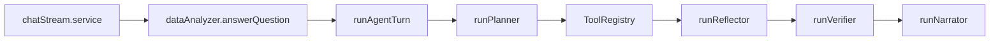

# Agents architecture inventory

> **Last updated:** 2026-04-28 · **Status:** reflects HEAD (post-Wave W55).
> The earlier "two coexisting layers" framing is **obsolete** — the legacy `AgentOrchestrator` and handler chain were deleted in commit `9422bed7` (2026-04-26). When updating this file, verify against the live tree and bump this header.

This document is **reference** for developers and AI assistants: it maps every "agent"-related module in the RAG-InsightingTool repo and describes how they connect. Optional trace handoffs (`AGENT_INTER_AGENT_MESSAGES`) add structured fields to `AgentTrace` only when enabled.

**Related design docs**

- High-level orientation: [CLAUDE.md](../CLAUDE.md) (the holy bible — read this first).
- Product rollout and RAG invariants: [plans/agentic_only_rag_chat.md](plans/agentic_only_rag_chat.md).
- Agentic loop, verifier/critic, SSE concepts: [plans/agentic_analysis_architecture.md](plans/agentic_analysis_architecture.md).
- Runtime details: [architecture/agent-runtime.md](architecture/agent-runtime.md), [architecture/tool-registry.md](architecture/tool-registry.md), [architecture/skills.md](architecture/skills.md), [architecture/mmm.md](architecture/mmm.md).

---

## 1. Executive summary

There is **one** path through the system: the agentic plan/act loop. [`runAgentTurn`](../server/lib/agents/runtime/agentLoop.service.ts) runs a **planner → tools → reflector → verifier → narrator** sequence with budgets and trace. The previous handler-based orchestrator is gone — its files (`orchestrator.ts`, `index.ts`, `handlers/*`, `contextRetriever.ts`) were removed in commit `9422bed7` on 2026-04-26.

Routing is centralised in [`answerQuestion`](../server/lib/dataAnalyzer.ts), which **throws** if `AGENTIC_LOOP_ENABLED` is not `true`:

```ts
// server/lib/dataAnalyzer.ts:459
if (!isAgenticLoopEnabled()) {
  throw new Error("AGENTIC_LOOP_ENABLED must be true; the legacy orchestrator has been removed.");
}
```



The investigation subsystem (blackboard, hypothesis planner, coordinator, investigation tree) sits underneath this loop and is summarised in §5 below.

---

## 2. Primary entry points

| Location | Role |
|----------|------|
| [server/lib/dataAnalyzer.ts](../server/lib/dataAnalyzer.ts) | **`answerQuestion`** — agentic-only entry; builds `AgentExecutionContext` and calls `runAgentTurn`. |
| [server/services/chat/chatStream.service.ts](../server/services/chat/chatStream.service.ts) | Streaming chat: mode classification, schema binding, agent SSE → workbench, per-step insight enrichment, persist + session-context merge. |
| [server/services/chat/chat.service.ts](../server/services/chat/chat.service.ts) | Non-streaming chat path; same agentic delegation. |
| [server/services/chat/answerQuestionContext.ts](../server/services/chat/answerQuestionContext.ts) | Context assembly for `answerQuestion`. |
| [server/index.ts](../server/index.ts) | Startup; [`assertAgenticRagConfiguration`](../server/lib/agents/runtime/assertAgenticRag.ts) runs inside `createApp()` and fails boot on misconfig. |

---

## 3. Agentic runtime loop

| File | Role |
|------|------|
| [agentLoop.service.ts](../server/lib/agents/runtime/agentLoop.service.ts) | **`runAgentTurn`** — main loop, budgets, synthesis, SSE callbacks. |
| [planner.ts](../server/lib/agents/runtime/planner.ts) | Structured planning (`runPlanner`). |
| [reflector.ts](../server/lib/agents/runtime/reflector.ts) | Post-tool **continue / replan / finish / clarify**. |
| [verifier.ts](../server/lib/agents/runtime/verifier.ts) | **Verifier** + `rewriteNarrative`. Step-level invocation gated on `result.answerFragment` (W1). |
| [narratorAgent.ts](../server/lib/agents/runtime/narratorAgent.ts) | Reads the analytical blackboard and emits the structured `NarratorOutput` envelope. Streaming-capable when `STREAMING_NARRATOR_ENABLED=true` (W38). |
| [synthesisFallback.ts](../server/lib/agents/runtime/synthesisFallback.ts) | Empty-blackboard fallback path. |
| [tools/registerTools.ts](../server/lib/agents/runtime/tools/registerTools.ts) | One-shot boot registration of all tools. |
| [toolRegistry.ts](../server/lib/agents/runtime/toolRegistry.ts) | `ToolRegistry`, dispatch, zod arg-parsing, telemetry. |
| [types.ts](../server/lib/agents/runtime/types.ts) | `AgentExecutionContext`, `AgentTrace`, `VerdictType`, `PlanStep`, `AgentLoopResult`, env-flag readers. |
| [schemas.ts](../server/lib/agents/runtime/schemas.ts) | Zod / JSON schemas for planner, verifier, narrator, blackboard. |
| [llmJson.ts](../server/lib/agents/runtime/llmJson.ts) | Structured LLM completion helper (`completeJson`, `completeJsonStreaming`). |
| [callLlm.ts](../server/lib/agents/runtime/callLlm.ts) | Provider-agnostic LLM wrapper (Azure OpenAI ↔ Anthropic via `OPENAI_MODEL_FOR_*`). Test stub via `__setLlmStubResolver` (W18). |
| [anthropicProvider.ts](../server/lib/agents/runtime/anthropicProvider.ts) | Claude Opus 4.7 routing implementation. |
| [llmCostModel.ts](../server/lib/agents/runtime/llmCostModel.ts), [llmUsageEmitter.ts](../server/lib/agents/runtime/llmUsageEmitter.ts), [llmCallPurpose.ts](../server/lib/agents/runtime/llmCallPurpose.ts) | Cost telemetry. |
| [context.ts](../server/lib/agents/runtime/context.ts) | Prompt context summarisation (`summarizeContextForPrompt`, `formatUserAndSessionJsonBlocks`). |
| [workingMemory.ts](../server/lib/agents/runtime/workingMemory.ts) | Per-turn working memory; cap at `AGENT_OBSERVATION_MAX_CHARS`. |
| [memoryEntryBuilders.ts](../server/lib/agents/runtime/memoryEntryBuilders.ts) + [memoryLifecycleBuilders.ts](../server/lib/agents/runtime/memoryLifecycleBuilders.ts) + [memoryRecall.ts](../server/lib/agents/runtime/memoryRecall.ts) | Working-memory lifecycle helpers. |
| [visualPlanner.ts](../server/lib/agents/runtime/visualPlanner.ts) | Extra chart planning; `AGENT_MAX_EXTRA_CHARTS_PER_TURN`. |
| [plannerColumnResolve.ts](../server/lib/agents/runtime/plannerColumnResolve.ts) | Column name resolution for planner. |
| [planArgRepairs.ts](../server/lib/agents/runtime/planArgRepairs.ts) | Plan argument repairs (filter injection, dimension hygiene). |
| [chartProposalValidation.ts](../server/lib/agents/runtime/chartProposalValidation.ts) | Chart proposal validation. |
| [buildIntermediateInsight.ts](../server/lib/agents/runtime/buildIntermediateInsight.ts) | Intermediate insights for SSE workbench rows. |
| [enrichStepInsights.ts](../server/lib/agents/runtime/enrichStepInsights.ts) | Single-batched LLM call enriching workbench step insights (W19, env-gated `RICH_STEP_INSIGHTS_ENABLED`). |
| [agentLogger.ts](../server/lib/agents/runtime/agentLogger.ts) | Structured agent logging. |
| [interAgentMessages.ts](../server/lib/agents/runtime/interAgentMessages.ts) | Optional `interAgentMessages` on trace (`AGENT_INTER_AGENT_MESSAGES`). |
| [assertAgenticRag.ts](../server/lib/agents/runtime/assertAgenticRag.ts) | Startup RAG assertion. |
| [index.ts](../server/lib/agents/runtime/index.ts) | Re-exports `runAgentTurn`, constants. |
| [runDataOpsFromAgent.ts](../server/lib/agents/runDataOpsFromAgent.ts) | Tool path into Data Ops without `processQuery`. |
| [analysisBrief.ts](../server/lib/agents/runtime/analysisBrief.ts) | Diagnostic-intent brief generation. |
| [runHypothesisAndBrief.ts](../server/lib/agents/runtime/runHypothesisAndBrief.ts) | W39 merged pre-planner LLM call (env-gated `MERGED_PRE_PLANNER`). |
| [verifyNarrativeNumbers.ts](../server/lib/agents/runtime/verifyNarrativeNumbers.ts) + [checkMagnitudesAgainstObservations.ts](../server/lib/agents/runtime/checkMagnitudesAgainstObservations.ts) + [checkEnvelopeCompleteness.ts](../server/lib/agents/runtime/checkEnvelopeCompleteness.ts) + [verifierHelpers.ts](../server/lib/agents/runtime/verifierHelpers.ts) | Deterministic narrative-quality gates (W17, W22, W35) — fired before the deep verifier. |
| [budgetOptimizerAdapter.ts](../server/lib/agents/runtime/budgetOptimizerAdapter.ts) | MMM output adapter (W54) — builds recommendations / magnitudes / domainLens from `runBudgetRedistribute` results. |
| [buildDashboard.ts](../server/lib/agents/runtime/buildDashboard.ts) + [buildDashboardPrompt.ts](../server/lib/agents/runtime/buildDashboardPrompt.ts) + [dashboardAutogenGate.ts](../server/lib/agents/runtime/dashboardAutogenGate.ts) + [dashboardFeatureSweep.ts](../server/lib/agents/runtime/dashboardFeatureSweep.ts) + [dashboardTemplates.ts](../server/lib/agents/runtime/dashboardTemplates.ts) | Phase-2 dashboard autogen (env-gated `DASHBOARD_AUTOGEN_ENABLED`). |
| [skills/](../server/lib/agents/runtime/skills/) | Phase-1 analytical skills (see [docs/architecture/skills.md](architecture/skills.md)). |

---

## 4. Investigation subsystem

These modules orchestrate multi-question, hypothesis-driven analytical turns; they sit underneath the loop and persist evidence to a structured blackboard.

| File | Role |
|------|------|
| [analyticalBlackboard.ts](../server/lib/agents/runtime/analyticalBlackboard.ts) | Shared structured evidence store: findings, hypotheses, open questions, methodology notes, domain context entries. |
| [hypothesisPlanner.ts](../server/lib/agents/runtime/hypothesisPlanner.ts) | Decomposes the user's question into hypotheses (status: confirmed / refuted / open). |
| [coordinatorAgent.ts](../server/lib/agents/runtime/coordinatorAgent.ts) | Lightweight coordinator (`decomposeQuestion`); currently shipped but not invoked from `answerQuestion` per the W11–W13 single-flow policy. |
| [investigationTree.ts](../server/lib/agents/runtime/investigationTree.ts) + [investigationOrchestrator.ts](../server/lib/agents/runtime/investigationOrchestrator.ts) | BFS outer loop over a tree of sub-questions. |
| [contextAgent.ts](../server/lib/agents/runtime/contextAgent.ts) | Multi-round RAG resolution before tool calls. |
| [priorInvestigations.ts](../server/lib/agents/runtime/priorInvestigations.ts) | W21 carry-over: distils a turn's blackboard into a digest; appended into `sessionAnalysisContext.sessionKnowledge.priorInvestigations` (FIFO, capped at 5). Surfaced via `PriorInvestigationsBanner` (W26). |
| [buildInvestigationSummary.ts](../server/lib/agents/runtime/buildInvestigationSummary.ts) | W13 — distils the full blackboard into the persistable digest (hypotheses + findings + open questions). |
| [buildSynthesisContext.ts](../server/lib/agents/runtime/buildSynthesisContext.ts) | W7 — composes the four-block synthesis bundle (data / user / RAG / domain) consumed by narrator + synthesizer. |
| [insightHelpers.ts](../server/lib/agents/runtime/insightHelpers.ts) | Maps blackboard signals → `InsightCard`. |

---

## 5. Chat streaming, session context, and UI

| File | Role |
|------|------|
| [server/services/chat/agentWorkbench.util.ts](../server/services/chat/agentWorkbench.util.ts) | SSE events → `AgentWorkbenchEntry`, size caps, `AGENT_SSE_CRITIC_FINAL_ONLY`. |
| [server/services/chat/intermediatePivotPolicy.ts](../server/services/chat/intermediatePivotPolicy.ts) | Intermediate pivot coalescing; `AGENT_INTERMEDIATE_PIVOT_COALESCE`. |
| [server/lib/sessionAnalysisContext.ts](../server/lib/sessionAnalysisContext.ts) | Mid-turn session merge; `AgentMidTurnSessionPayload`, trace summary for prompts; `persistMergeAssistantSessionContext` per-session mutex (W40); `regenerateStarterQuestionsLLM`. |
| [server/lib/sessionAnalysisContextGuards.ts](../server/lib/sessionAnalysisContextGuards.ts) | Schema guards for the session context. |

**Shared schema** (message fields)

- [server/shared/schema.ts](../server/shared/schema.ts) and [client/src/shared/schema.ts](../client/src/shared/schema.ts) — `agentWorkbench`, `AgentWorkbenchEntry`, `answerEnvelope`, `investigationSummary`, thinking / trace shapes.
- **Flow visibility**: `AgentWorkbenchEntry` supports `kind: "flow_decision"` with a structured `flowDecision: { layer, chosen, overriddenBy?, reason?, confidence?, candidates? }` payload.
- **Single-flow policy (W11–W13)**: the agent loop no longer silently overrides the planned flow. Reflector `replan` is suppressed; verifier `reviseNarrative` no longer triggers `rewriteNarrative` for LLM-authored narratives; `runDeepInvestigation` / `coordinatorAgent.decomposeQuestion` are no longer called from `answerQuestion`. The capabilities still exist as standalone code and can be re-wired behind feature flags. **W4 exception**: when `answerSource === "fallback"`, the final verifier is skipped entirely.

**Client**

- [client/src/pages/Home/modules/useHomeMutations.ts](../client/src/pages/Home/modules/useHomeMutations.ts) — live workbench / streaming-narrator-preview / spawned-sub-questions state.
- [client/src/pages/Home/Components/ChatInterface.tsx](../client/src/pages/Home/Components/ChatInterface.tsx) — passes workbench to UI.
- [client/src/pages/Home/Components/MessageBubble.tsx](../client/src/pages/Home/Components/MessageBubble.tsx) — renders workbench / thinking / AnswerCard / chart commentary / pivot / Investigation card.
- [client/src/pages/Home/Components/AnswerCard.tsx](../client/src/pages/Home/Components/AnswerCard.tsx) — renders the structured `answerEnvelope`.
- [client/src/pages/Home/Components/ThinkingPanel.tsx](../client/src/pages/Home/Components/ThinkingPanel.tsx) + [StepByStepInsightsPanel.tsx](../client/src/pages/Home/Components/StepByStepInsightsPanel.tsx) + [StreamingPreviewCard.tsx](../client/src/pages/Home/Components/StreamingPreviewCard.tsx) — live agent visibility.
- [client/src/pages/Home/Components/InvestigationSummaryCard.tsx](../client/src/pages/Home/Components/InvestigationSummaryCard.tsx) + [PriorInvestigationsBanner.tsx](../client/src/pages/Home/Components/PriorInvestigationsBanner.tsx) — investigation provenance surfaces.
- [client/src/lib/api/chat.ts](../client/src/lib/api/chat.ts) — documents SSE kinds (`agent_workbench`, `answer_chunk`, `session_context_updated`, `sub_question_spawned`, `streaming_preview`, `workbench_enriched`).

---

## 6. Cross-cutting imports (agent-adjacent)

These modules are used by analysis, charts, or agent tools but are not the full "loop":

| Area | Example paths |
|------|----------------|
| Column matching | [server/lib/agents/utils/columnMatcher.ts](../server/lib/agents/utils/columnMatcher.ts) — used from chart builders, pivot helpers, `dataTransform`, `fileParser`, etc. |
| Column extraction | [server/lib/agents/utils/columnExtractor.ts](../server/lib/agents/utils/columnExtractor.ts) |
| Filter inference | [server/lib/agents/utils/inferFiltersFromQuestion.ts](../server/lib/agents/utils/inferFiltersFromQuestion.ts) (W1–W6) |
| Schema binding | [server/lib/schemaColumnBinding.ts](../server/lib/schemaColumnBinding.ts) |
| Data Ops | [server/lib/dataOps/dataOpsOrchestrator.ts](../server/lib/dataOps/dataOpsOrchestrator.ts), [server/lib/dataOps/pythonService.ts](../server/lib/dataOps/pythonService.ts), [server/lib/dataOps/mmmService.ts](../server/lib/dataOps/mmmService.ts) |
| MMM column tagger | [server/lib/marketingColumnTags.ts](../server/lib/marketingColumnTags.ts) |
| Segment-driver tool | [server/lib/segmentDriverAnalysisTool.ts](../server/lib/segmentDriverAnalysisTool.ts) |
| Skills | [server/lib/agents/runtime/skills/](../server/lib/agents/runtime/skills/) — `varianceDecomposer`, `driverDiscovery`, `insightExplorer`, `timeWindowDiff`, `parallelResolve` |
| Tests | [server/tests/agent*.ts](../server/tests/), planner/tool/runtime/skill tests |

**Python service** — [python-service/](../python-service/): no agent-specific orchestration in tree (FastAPI data-ops + MMM optimiser only).

---

## 7. Environment variables (agent-related)

| Variable | Where used | Notes |
|----------|------------|--------|
| `AGENTIC_LOOP_ENABLED` | `dataAnalyzer.ts`, `types.ts`, tests | Must be `"true"`. `answerQuestion` throws otherwise. |
| `AGENTIC_ALLOW_NO_RAG` | `assertAgenticRag.ts` | Tests / local experiments without RAG. |
| `AGENT_MAX_STEPS` | `types.ts` | Default 30. |
| `AGENT_MAX_WALL_MS` | `types.ts` | Default 600 000. |
| `AGENT_MAX_TOOL_CALLS` | `types.ts` | Default 60. |
| `AGENT_MAX_VERIFIER_ROUNDS_STEP` | `types.ts` | Default 2. |
| `AGENT_MAX_VERIFIER_ROUNDS_FINAL` | `types.ts` | Default 2. |
| `AGENT_MAX_LLM_CALLS` | `types.ts` | Per-turn LLM budget. |
| `AGENT_SAMPLE_ROWS_CAP` | `types.ts` | Default 200. |
| `AGENT_OBSERVATION_MAX_CHARS` | `types.ts` | Default 8 000. |
| `AGENT_MAX_EXTRA_CHARTS_PER_TURN` | `visualPlanner.ts` | Default 2. |
| `AGENT_MID_TURN_CONTEXT` | `agentLoop.service.ts` | `"false"` disables mid-turn context hook. |
| `AGENT_MID_TURN_CONTEXT_THROTTLE_MS` | `agentLoop.service.ts` | Default 8 000. |
| `AGENT_INTERMEDIATE_PIVOT_COALESCE` | `intermediatePivotPolicy.ts` | Pivot SSE coalescing. |
| `AGENT_INTER_AGENT_MESSAGES` | `types.ts`, `interAgentMessages.ts` | Records `AgentTrace.interAgentMessages`; emits SSE `handoff` → workbench kind `handoff`. |
| `AGENT_INTER_AGENT_PROMPT_FEEDBACK` | `planner.ts`, `reflector.ts` | Injects handoff digest into planner + reflector prompts (more tokens). |
| `AGENT_SSE_CRITIC_FINAL_ONLY` | `agentWorkbench.util.ts` | Show more critic SSE when `0`/`false`. |
| `AGENT_VERBOSE_LOGS` | `fileParser.ts` | Verbose logging. |
| `AGENT_TRACE_MAX_BYTES` | `agentLoop.service.ts` | Trace byte cap. |
| `AGENT_TOOL_TIMEOUT_MS` | `toolRegistry.ts` | Per-tool wall-time bound. |
| `STREAMING_NARRATOR_ENABLED` | `narratorAgent.ts`, `llmJson.ts` | W38 — streaming narrator output (Azure OpenAI only). |
| `RICH_STEP_INSIGHTS_ENABLED` | `enrichStepInsights.ts` | W19 — per-step LLM-enriched insights. |
| `MERGED_PRE_PLANNER` | `runHypothesisAndBrief.ts` | W39 — merged hypothesis + analysis-brief LLM call. |
| `DASHBOARD_AUTOGEN_ENABLED` | `dashboardAutogenGate.ts` | Phase-2 dashboard autogen. |
| `DEEP_ANALYSIS_SKILLS_ENABLED` | `skills/types.ts` | Phase-1 skills exposure to planner. |
| `WEB_SEARCH_ENABLED` + `TAVILY_API_KEY` | `tools/webSearchTool.ts` | W14 — web search tool execution. |
| `LIVE_LLM_REPLAY` + `RECORD_LIVE_LLM_BASELINE` | golden-replay tests | W28 / W33 — live LLM CI. |
| `ANTHROPIC_API_KEY` + `OPENAI_MODEL_FOR_NARRATOR` / `_VERIFIER_DEEP` / `_COORDINATOR` / `_HYPOTHESIS` | `anthropicProvider.ts`, `callLlm.ts` | Per-role Claude Opus 4.7 routing; falls back to Azure OpenAI when key missing. |

RAG variables when agentic is on are documented in [server/.env.example](../server/.env.example) and [assertAgenticRag.ts](../server/lib/agents/runtime/assertAgenticRag.ts).

---

## 8. Multi-agent posture

Today's agentic path is multi-role (planner, tools, reflector, verifier, narrator) inside **one** orchestrating function. The single-flow policy (W11–W13) keeps the planner's chosen flow honest — silent overrides are gone; replan / rewrite candidates are emitted as `flow_decision` SSE rows for visibility but the original plan still runs.

**Implemented building blocks (additive, default-off):**

- Append-only **[`InterAgentMessage`](../server/lib/agents/runtime/types.ts)** on `AgentTrace.interAgentMessages` when `AGENT_INTER_AGENT_MESSAGES=true` (`from`, `to`, `intent`, `artifacts[]`, `evidenceRefs[]`, `blockingQuestions[]`, `meta`).
- Optional SSE **`handoff`** → workbench rows.
- Optional **prompt feedback** (`AGENT_INTER_AGENT_PROMPT_FEEDBACK=true`) injecting a handoff digest into planner + reflector prompts.

**Future (not yet implemented):**

- Tool partition per logical agent role (subset tools per role from `registerTools.ts`).
- Debate / second-opinion verifier (Proposer + Skeptic with bounded rounds).
- Explicit session persistence flags for "awaiting user" beyond the current `clarify` return path.
- Separate specialist processes — avoid until evidence in-process is insufficient.

**What to avoid early:** unbounded agent-to-agent LLM chains (blows `AGENT_MAX_LLM_CALLS`); re-wiring `coordinatorAgent.decomposeQuestion` into `answerQuestion` without a feature flag (the single-flow policy is intentional).

---

## 9. Verification checklist

- Doc-only changes: no `npm test` required.
- After any future code change to agents: `cd server && npm test` and (if charts / Phase-1 skills touched) `cd client && npm test && npm run theme:check`.
- For runtime regressions, the W20 e2e smoke test (`tests/agentTurnE2EW20.test.ts`) is the "all wave outputs combined" gate.
- For prompt-quality drift, run the live-LLM golden replay (`LIVE_LLM_REPLAY=true cd server && node --import tsx --test tests/liveLlmGoldenReplayW28.test.ts`).

---

## 10. Quick file index (grep-friendly)

| Pattern | Meaning |
|---------|---------|
| `server/lib/agents/runtime/**` | Agentic loop, planner, tools, verifier, reflector, narrator, blackboard, skills |
| `server/lib/agents/utils/**` | Column matching, column extraction, filter inference |
| `runAgentTurn` | Agentic turn entry |
| `agentWorkbench` | Persisted + live UI trace blocks |
| `analyticalBlackboard` | Shared evidence store between planner / tools / narrator |
| `priorInvestigations` | FIFO carry-over of compact turn digests across the session (W21) |
| `analysis_memory` (Cosmos container) | W56 · per-session append-only journal of every analytical event; partition `/sessionId`; mirrored to AI Search (W57); user-visible at `/analysis/:sessionId/memory` (W62) |

---

*Last reviewed against repo HEAD on 2026-04-28; bump this date when the file is updated.*
