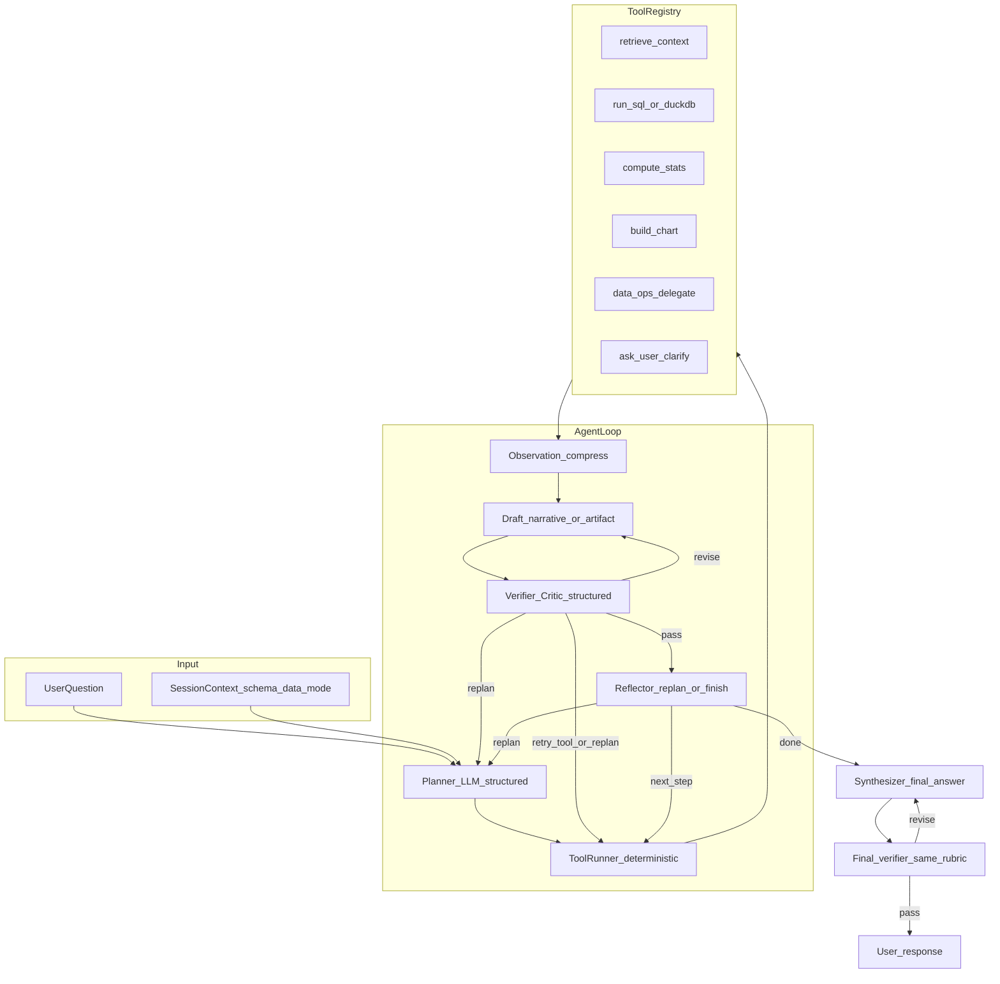

> **In-repo mirror** of the Cursor plan `agentic_analysis_architecture_3e5b532f` (see `~/.cursor/plans/` on your machine). Paths below are relative to this repository root.

# Agentic analysis architecture (plan–act–observe)

## Critique of the current system (baseline)

Today the “agent” is mostly **[`server/lib/agents/orchestrator.ts`](server/lib/agents/orchestrator.ts)**: one-shot **intent classification** ([`intentClassifier.ts`](server/lib/agents/intentClassifier.ts)), **one handler** from a chain, heavy **regex/branch overrides**, then a final answer. [`ThinkingStep`](server/shared/schema.ts) events in [`chatStream.service.ts`](server/services/chat/chatStream.service.ts) reflect **fixed phases**, not **model-chosen subtasks** or **tool observations** fed back into the model.

That is **orchestrated automation**, not an **agent loop** (no durable plan, no re-planning after observation, no multi-step self-delegation with verifiable intermediate outputs).

---

## Target behavior (definition of “truly agentic” here)

1. **Understand**: Normalize question + session context (schema summary, prior messages, data mode: in-memory vs columnar).
2. **Plan**: Emit an explicit, structured **plan** (ordered steps, success criteria, optional branches).
3. **Execute**: For each step, call **tools** (bounded, typed); capture **observations** (truncated/summarized for LLM).
4. **Reflect**: After each observation, allow **continue | replan | stop | ask user** (within limits).
5. **Verify (mandatory)**: After **every substantive generated output**—not only after tools—run a **Verifier/Critic** pass against the **original user ask** and **grounding evidence** (tool result IDs, schema, prior plan). If the verdict is not pass, **course-correct** (see dedicated section below) before exposing the output as final or before proceeding to the next planned step.
6. **Synthesize**: Final user-facing answer + charts/insights; attach **trace** (plan + step summaries + critic rounds) for UX and debugging.

Intermediate **outputs per step** must be real artifacts: tool result summary, mini chart spec, table preview row count, error with recovery attempt—not only spinner text. Each such artifact (and any **draft narrative** the model produces about it) goes through **verify → correct if needed** before the loop continues or before the user sees it as “done” for that step.

---

## Architecture (best-practice pattern)

Use a **plan–execute–observe** loop with a **tool registry** (function-calling or JSON-schema tools), not a growing if/else router.

**Reflector vs Verifier (both required)**

- **Reflector**: strategic control—what to do next in the plan (next tool, replan, finish, clarify). It consumes **compressed observations** and plan state.
- **Verifier/Critic**: quality and **goal alignment**—whether the **current candidate output** (explanation of a tool result, chart choice, or final answer) **actually satisfies** the user’s original request and **does not contradict** tool outputs or schema. This is the component that answers your requirement: *observe and critique itself after every response it generates*.

Without a dedicated Verifier, “reflect after tool” alone often **approves wrong narratives** that sound plausible but misstate numbers or dodge the question.

**Principles baked in**

- **Separation of concerns**: Planner proposes; tools **validate** inputs against schema; no free-form SQL from the planner without a second validation layer (reuse patterns from [`duckdbPlanExecutor.ts`](server/lib/duckdbPlanExecutor.ts) / [`dataApi.ts`](server/routes/dataApi.ts) where applicable).
- **Bounded autonomy**: `max_steps`, `max_wall_time`, `max_tool_calls`, **token budgets** for observations; hard stop → graceful partial answer + “what I could not finish.”
- **Deterministic core**: Numeric truth from tools; the LLM **interprets** and **narrates**, not invents aggregates (unless tool explicitly returns “unavailable”).
- **Observable**: Structured trace (plan version, each tool, latency, row counts, errors) for logs and optional UI “expand trace.”

---

## Self-observation, critique, and course correction (Verifier/Critic) — core design

**Answer: Yes.** The design explicitly gives the system the ability to **observe its own outputs**, **critique them against the user’s original goal**, and **course-correct** when something is amiss. This is **not** optional polish; it is a **mandatory gate** on every substantive generation, with **bounded retries** so cost and latency stay under control.

### What “every response” means (granularity)

The Verifier runs on **candidate outputs** at this granularity (each is a separate critique unit):

| Output type | Examples | Why verify here |
|-------------|----------|------------------|
| **Post-tool narrative** | Short explanation of what a query/stat/correlation returned | Prevents hallucinated metrics or wrong column interpretation before the next step uses it as “fact.” |
| **Intermediate user-visible artifact** | Proposed chart spec, table preview caption, “here is what I found” paragraph | Catches wrong chart type, wrong axis, or answer that ignores a filter the user asked for. |
| **Pre-final draft** | Full draft answer before `done` | Allows rewrite pass without burning another full tool chain. |
| **Final answer** | Text + charts + insights shipped to the user | Last line of defense; must pass the same rubric plus **consistency across sections** (narrative vs chart titles vs numbers). |

Skipping verification on “small” strings is a slippery slope; in implementation, **anything streamed as `message` or attached as chart/insight** should pass through or be marked `preview` until verified.

### Inputs to the Verifier (grounding contract)

Each Verifier call receives a **fixed context bundle** (serialized, capped):

1. **User goal**: Original question + resolved references (from context resolution); optional **checklist** derived from the plan (“user asked for X, Y, Z”).
2. **Evidence pointers**: List of `tool_call_id` / hashes of tool outputs actually used; **not** the entire raw table unless small—prefer summaries and row counts the tools already emit.
3. **Candidate**: The exact text/spec to judge (draft answer, chart JSON, etc.).
4. **Constraints**: Schema column list, data mode (columnar vs in-memory), and **forbidden claims** (e.g. “do not claim exact counts if tool returned approximate”).

The critic must **cite evidence IDs** when claiming alignment or mismatch (reduces model hand-waving and helps debugging).

### Structured verdict (machine-checkable)

Use a **Zod schema** (same stack as the rest of the server) for the Verifier output, e.g.:

- **`verdict`**: `pass` | `revise_narrative` | `retry_tool` | `replan` | `ask_user` | `abort_partial`
- **`scores`** (0–1 optional): goal_alignment, evidence_consistency, completeness, scope (did not over-answer unsafe), clarity
- **`issues`**: array of `{ code, severity, description, evidence_refs[] }` — e.g. `NUMERIC_MISMATCH`, `IGNORED_FILTER`, `UNSUPPORTED_CHART_FOR_DATA`, `OVERCONFIDENT_CLAIM`
- **`course_correction`**: one structured action (see below)
- **`user_visible_note`** (optional): short explanation if the UI should show “I rechecked and adjusted …”

This makes critique **auditable** in `agentTrace` and in logs.

### Course-correction actions (what happens when something is amiss)

The Verifier does not “vaguely try again”; it selects a **typed recovery**:

| Action | When to use | Effect |
|--------|----------------|--------|
| `revise_narrative` | Wording wrong, tone wrong, or minor misstatement fixable without new data | Same tool results; **rewrite** candidate only (cheaper LLM call). |
| `retry_tool` | Wrong args, empty result suspicious, or numeric inconsistency | Re-run **one** tool with revised args (bounded `retry_tool` count per step). |
| `replan` | Wrong approach (e.g. user wanted trend over time but agent ran a single aggregate) | Back to Planner with **Verifier issues** as constraints (“previous attempt failed because …”). |
| `ask_user` | Ambiguity impossible to resolve from data | Emit structured clarify (existing `clarify_user` tool pattern). |
| `abort_partial` | Budget exhausted or data missing | Return honest partial result + what failed verification. |

**Caps (non-negotiable)**

- `max_verifier_rounds_per_step` (e.g. 2–3)
- `max_verifier_rounds_final` (e.g. 2)
- `max_total_llm_calls_per_user_turn` including planner + reflector + verifier
- If caps hit → **stop** with partial output and explicit “verification budget exceeded” in trace

### Deterministic checks (hybrid critic)

Not everything should be LLM-judged. **Programmatic pre-verifiers** run **before** the LLM critic when cheap:

- Parse numbers from candidate answer; compare to **last numeric tool payload** within tolerance.
- Chart spec: `x`/`y` must exist in schema; enum chart types only.
- If mismatch → short-circuit verdict `revise_narrative` or `retry_tool` **without** calling the critic, or attach `issues` for the critic to confirm.

This improves robustness and cuts cost.

### Same model vs separate “critic” model

- **MVP**: Same chat model with a **strict system rubric** and **low temperature** for Verifier calls; separate prompt role `You are a verifier, not an assistant`.
- **Hardening**: Optional second deployment (e.g. smaller or “reasoning” model) **only for verification** to reduce self-confirmation bias; same schema output.
- **Bias mitigation**: Verifier prompt explicitly: “Assume the draft may be wrong; your job is to find errors.”

### Streaming UX

Extend SSE (see below) with:

- **`critic_verdict`**: `{ stepId, verdict, issue_codes[], course_correction }` (user-facing summary can be sanitized).
- Optional **`draft`** / **`final`** distinction so the client can show “Reviewing answer…” during verification.

### Relationship to phases

- **Phase 2**: After multi-tool run, add **Verifier on the composed draft** (simplest first integration).
- **Phase 3**: Verifier **inside** the loop after **each** tool narrative + after reflector chooses “done.”
- **Phase 3b** (explicit todo): Final-answer verifier + deterministic numeric checks + trace persistence.

---

## Tool registry (concrete direction)

Implement tools as **TypeScript modules** with Zod input/output schemas (align with existing [`zod`](server/package.json) usage). Initial set (iterative):

| Tool | Purpose |
|------|---------|
| `get_schema_summary` | Cheap: column names, types, row count (from existing summary) |
| `sample_rows` | Stratified or head/tail sample with cap |
| `run_analytical_query` | Wrap existing analytical path ([`analyticalQueryExecutor.ts`](server/lib/analyticalQueryExecutor.ts) / DuckDB columnar when available) |
| `run_correlation` | Delegate to existing correlation pipeline |
| `run_chart_pipeline` | Delegate to [`chartGenerator.ts`](server/lib/chartGenerator.ts) / handler logic behind a thin adapter |
| `data_ops` | Narrow API to existing [`DataOpsHandler`](server/lib/agents/handlers/dataOpsHandler.ts) for mutations |
| `clarify_user` | Structured question + options (replaces ad-hoc clarification in orchestrator over time) |
| `retrieve_semantic_context` | **Implemented**: Azure AI Search vector retrieval per `sessionId`, optional `dataVersion` = `currentDataBlob.version` ([`retrieve.ts`](server/lib/rag/retrieve.ts), [`registerTools.ts`](server/lib/agents/runtime/tools/registerTools.ts)) |

**Refactor strategy**: Handlers become **tool backends**; the orchestrator’s `canHandle` chain is **deprecated** behind adapters so behavior does not regress in one shot.

---

## Azure AI Search RAG (implemented)

Session-scoped semantic retrieval is backed by **Azure AI Search** (not pgvector). Relevant paths:

| Concern | Location |
|--------|----------|
| Feature flag + Search credentials | [`server/lib/rag/config.ts`](server/lib/rag/config.ts) — `RAG_ENABLED=true` and `AZURE_SEARCH_ENDPOINT`, `AZURE_SEARCH_ADMIN_KEY`, `AZURE_SEARCH_INDEX_NAME` |
| Embeddings | [`server/lib/rag/embeddings.ts`](server/lib/rag/embeddings.ts) — same Azure OpenAI embedding deployment as upload/analysis; `AZURE_OPENAI_EMBEDDING_DIMENSIONS` must match index dimension |
| Index definition | [`server/lib/rag/createSearchIndex.ts`](server/lib/rag/createSearchIndex.ts) — vector field must be **searchable** per current Search API |
| Admin | `npm run create-rag-index` from [`server/`](server/) (loads `server/server.env` via [`loadEnv.ts`](server/loadEnv.ts)) |
| Smoke | `npm run rag-smoke` — optional `RAG_SMOKE_SESSION_ID`, `RAG_SMOKE_QUERY` for end-to-end retrieval |
| Reindex triggers | After upload save: [`uploadQueue.ts`](server/utils/uploadQueue.ts); after Data Ops save: [`dataPersistence.ts`](server/lib/dataOps/dataPersistence.ts) — both call `scheduleIndexSessionRag` |
| Cosmos status | [`ChatDocument.ragIndex`](server/models/chat.model.ts) — `indexing` / `ready` / `error` |
| Legacy orchestrator context | [`retrieveContext`](server/lib/agents/contextRetriever.ts) — merges RAG passages into `dataChunks`; [`orchestrator.ts`](server/lib/agents/orchestrator.ts) loads `currentDataBlob.version` when RAG is on for version-filtered search |
| Agent loop | [`chatStream.service.ts`](server/services/chat/chatStream.service.ts) passes `dataBlobVersion` into `buildAgentExecutionContext`; planner rules mention `retrieve_semantic_context`; prior observations feed replans ([`agentLoop.service.ts`](server/lib/agents/runtime/agentLoop.service.ts)) |

Indexing runs **asynchronously** after document write; allow a short delay before expecting hits on a new session.

**Agent loop (chaining)**: Each tool turn appends a **structured working-memory line** (`callId`, `tool`, `ok`, `suggestedColumns`, `memorySlots`, summary preview) into the planner prompt on initial plan and replans ([`workingMemory.ts`](server/lib/agents/runtime/workingMemory.ts), [`agentLoop.service.ts`](server/lib/agents/runtime/agentLoop.service.ts)). Plans may set optional **`dependsOn`** on a step (id of another step in the same plan); steps are **topologically sorted** before execution so prerequisites run first. Tool adapters populate **`memorySlots`** where useful ([`registerTools.ts`](server/lib/agents/runtime/tools/registerTools.ts)). The verifier prompt instructs models to **prefer analytical tool numbers over RAG text** when they conflict ([`verifier.ts`](server/lib/agents/runtime/verifier.ts)).

---

## Streaming and client contract

Extend beyond today’s `thinking` SSE events:

- **`plan`**: JSON plan object (steps, rationale short).
- **`tool_call`**: `{ id, name, args_summary }` (no secrets).
- **`tool_result`**: `{ id, ok, summary, preview? }` (bounded size).
- **`critic_verdict`**: structured verdict + course-correction type (sanitized for UI).
- **`message_delta`** (optional later): streaming final narrative; distinguish **unverified draft** vs **verified final** if desired.

Update [`server/utils/sse.helper.ts`](server/utils/sse.helper.ts) / stream services and [`client` stream consumer](client/src/lib/api/chat.ts) to render **step cards** or a **timeline** (UX can be minimal in phase 1: append-only log).

Persist optional **`agentTrace`** on the assistant message in Cosmos (extend [`messageSchema`](server/shared/schema.ts) with an optional `agentTrace` blob or separate container for large traces).

---

## Phased rollout (non-negotiable for a codebase this size)

**Phase 0 – Instrumentation and interfaces**

- Define `AgentState`, `PlanStep`, `ToolCallRecord`, `AgentConfig` types in a new module (e.g. `server/lib/agents/runtime/`).
- Feature flag: `AGENTIC_LOOP_ENABLED` (or per-session header).

**Phase 1 – Shadow planner**

- New `PlannerService`: given question + context, output **structured plan only**; **do not** execute tools yet; log diff vs current orchestrator path. Validates prompts and schemas.

**Phase 2 – Tool runner + single-turn multi-tool**

- Execute **multiple tools in one user turn** without full replan loop (fixed plan from planner); stream `tool_call` / `tool_result`. Reduces risk vs full reflexion.

**Phase 3 – Full loop**

- After each observation, **reflector** LLM decides next step / replan / finish; enforce caps; integrate recovery ([`errorRecovery.ts`](server/lib/agents/utils/errorRecovery.ts) patterns).
- After **each substantive candidate output** (per-Tool narrative, draft, final), run **Verifier** with structured verdict and **course correction**; enforce `max_verifier_rounds_*` and optional **deterministic numeric checks** before LLM critique.

**Phase 3b – Verifier hardening**

- Final-answer verifier, cross-section consistency (text vs charts), critic SSE events, full `agentTrace` recording of critic rounds for evaluation and regressions.

**Phase 4 – Deprecate legacy router**

- Route traffic through agent loop by default; keep legacy [`AgentOrchestrator.processQuery`](server/lib/agents/orchestrator.ts) as fallback behind flag for regressions.

---

## Guardrails and safety

- **Authz**: Tools receive `sessionId` + verified user; reuse existing session checks ([`getChatBySessionIdForUser`](server/models/chat.model.ts)).
- **Data exfiltration**: Row caps, column allowlists from schema, no raw arbitrary SQL from planner (only validated query builders).
- **Cost**: Per-session rate limits on tool calls; cache tool results keyed by `(sessionId, tool, canonicalArgs)`.
- **Evaluation**: Curated **golden set** of questions (simple, analytical, chart, data-ops, failure cases); compare traces and numeric outputs before flipping default flag.

---

## Key files to touch (implementation map)

| Area | Files |
|------|--------|
| New runtime | `server/lib/agents/runtime/*` (loop, planner, reflector, **verifier**, tool registry) |
| Tools | `server/lib/agents/tools/*` + thin wrappers over `dataAnalyzer`, `analyticalQueryExecutor`, DuckDB, data ops |
| Entry | [`dataAnalyzer.ts`](server/lib/dataAnalyzer.ts) `answerQuestion` → branch to agent loop vs [`getOrchestrator`](server/lib/agents/orchestrator.ts) |
| Stream | [`chatStream.service.ts`](server/services/chat/chatStream.service.ts), [`chat.ts`](client/src/lib/api/chat.ts) (new SSE event types) |
| Schema | [`server/shared/schema.ts`](server/shared/schema.ts) + mirror in [`client/src/shared/schema.ts`](client/src/shared/schema.ts) if client parses traces |

---

## Appendix: Five self-critique iterations (how the plan was refined)

1. **Critique**: Plan too abstract, no migration path. **Refinement**: Added phased rollout, feature flag, shadow planner, handler-as-tool adapters.
2. **Critique**: “Agent” could mean infinite LLM calls and runaway cost. **Refinement**: Explicit budgets, caps, caching, and stop conditions; cheap planner model called out as optional.
3. **Critique**: Tabular domain needs numeric correctness. **Refinement**: Deterministic tools for truth; LLM for plan/synthesis only; reuse existing query validation patterns.
4. **Critique**: UX promise (“output each step”) needs a contract. **Refinement**: New SSE event types + optional `agentTrace` persistence; not only reusing generic `ThinkingStep` strings.
5. **Critique**: Big-bang rewrite would break production. **Refinement**: Legacy orchestrator remains fallback; golden-set evaluation gate before default-on.
6. **Critique** (user): Agent must **self-critique after every response** and **course-correct** vs original ask. **Refinement**: Added dedicated **Verifier/Critic** (distinct from Reflector), structured verdict schema, typed recovery actions, per-output verification granularity, deterministic pre-checks, SSE `critic_verdict`, Phase **3b** todo, and diagram loop `N → V`.

This sequence incorporates the original five internal iterations plus a sixth driven by explicit product requirements.
