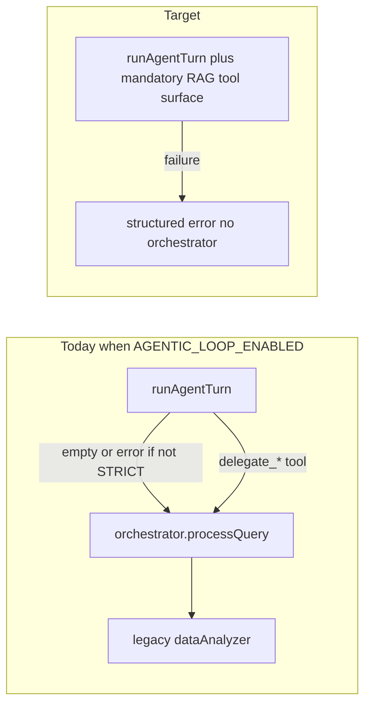

# Agentic-only analysis path (RAG mandatory, no legacy fallback)

**Team source of truth:** This file in `docs/plans/` is the canonical architecture and rollout plan for agentic-only, RAG-mandatory analysis chat. Implement and review against this document; keep it updated when phases complete.

Related: [agentic_analysis_architecture.md](./agentic_analysis_architecture.md) is **supplemental** reference for verifier/critic design, SSE event taxonomy, and architecture diagrams — not the source for rollout invariants. This plan narrows **product invariants** (RAG always on, no legacy fallback) and **execution phases**.

---

## Product invariant (non-negotiable)

**RAG is always enabled for this architecture.** There is no supported deployment where analysis chat runs with `RAG_ENABLED=false` or missing Azure AI Search credentials. Optional “works without RAG” behavior is **out of scope** and must not be used as a fallback when the agentic path is active.

Implications for engineering:

- **Configuration**: `RAG_ENABLED=true` plus `AZURE_SEARCH_*` (and embedding alignment with the index) are **required** for environments that serve agentic analysis chat. Document as mandatory in [`server/.env.example`](../../server/.env.example); consider **startup validation** in [`server/index.ts`](../../server/index.ts) or a dedicated `assertRagReadyForAgentic()` that fails fast or logs a blocking error if agentic analysis is expected but RAG is not viable.
- **[`retrieve_semantic_context`](../../server/lib/agents/runtime/tools/registerTools.ts)**: Today returns `ok: false` with a message when RAG is off. Under this plan, that branch becomes **misconfiguration or should not occur** in production; prefer **fail the turn** with a clear operator-facing message if Search is unreachable, rather than falling through to legacy code elsewhere.
- **Planner**: Treat semantic retrieval as a **first-class default** for questions that benefit from narrative/context (themes, wording, prior session text in chunks), not an optional add-on. Rules should state: use `retrieve_semantic_context` with `args.query` when the question is not purely a schema-known aggregate, subject to step budget.

## Current failure modes (from code and your logs)

1. **Planner does not see tool argument shapes** — [`ToolRegistry.listToolDescriptions()`](../../server/lib/agents/runtime/toolRegistry.ts) returns **comma-separated tool names only**. The planner invents keys like `query` for [`run_analytical_query`](../../server/lib/agents/runtime/tools/registerTools.ts), which only allows optional `question_override` (strict Zod). `query` is valid **only** for `retrieve_semantic_context`.
2. **“Agentic” still reaches the old stack** (addressed in implementation)
   - [`answerQuestion`](../../server/lib/dataAnalyzer.ts): when agentic is on, no orchestrator / legacy monolith fallback; failures are explicit with `agentTrace`.
   - Data ops in agent mode uses [`run_data_ops`](../../server/lib/agents/runtime/tools/registerTools.ts) → [`runDataOpsFromAgent.ts`](../../server/lib/agents/runDataOpsFromAgent.ts) (direct `DataOpsHandler`), not `AgentOrchestrator.processQuery`.
3. **Empty answer** from [`runAgentTurn`](../../server/lib/agents/runtime/agentLoop.service.ts) catch → outer fallback in `answerQuestion`.

---

## Design principles

- **Single analysis brain**: With agentic mode on for **analysis**, all answers come from `runAgentTurn` + tools + synthesis — not [`AgentOrchestrator`](../../server/lib/agents/orchestrator.ts) or monolithic legacy [`dataAnalyzer.ts`](../../server/lib/dataAnalyzer.ts).
- **RAG mandatory, not optional**: The agent is designed **RAG-first**. Degraded operation without search is **not** a product mode; fix config, index, or networking. **Empty RAG hits** (no chunks) are a valid runtime case and are handled inside the turn (planner may combine with `get_schema_summary` / `run_analytical_query`) — distinct from “RAG disabled.”
- **Explicit failure**: Budget, planner failure, or tool exhaustion → user-visible message + `agentTrace`, never silent handoff to legacy.

---

## Phase 0 — RAG required contract (new)

**Goal:** Align runtime and docs with “RAG always on.”

| Task | Detail |
|------|--------|
| **Startup / health** | If `AGENTIC_LOOP_ENABLED` (and analysis deployment profile), assert `isRagEnabled()` or equivalent; on failure, **exit or refuse analysis routes** with a clear error so misconfig is never mistaken for “slow model.” |
| **Remove dual-path semantics** | In [`registerTools.ts`](../../server/lib/agents/runtime/tools/registerTools.ts), replace “Semantic retrieval is not configured…” as a soft `ok: false` **only** if you keep a dev-only escape hatch; for production target, **throw or return hard error** so operators fix env. Document any dev-only `SKIP_RAG_CHECK` explicitly if absolutely needed for local unit tests (mock Search). |
| **Indexing lifecycle** | Tie to existing session indexing ([`scheduleIndexSessionRag`](../../server/lib/rag/indexSession.ts) after upload). Plan should verify: agentic turns assume index **eventually consistent**; document delay between upload and first retrieval. |
| **.env.example** | List `RAG_ENABLED=true`, `AZURE_SEARCH_*`, embedding dimension alignment as **required** for agentic+RAG stack. |

**Edge case:** Local unit tests that cannot hit Azure — use **mocks** for `retrieveRagHits`, not `RAG_ENABLED=false` for integration tests of the full stack.

---

## Phase 1 — Tool contract visibility

**Goal:** Planner never confuses `retrieve_semantic_context.query` with `run_analytical_query` args.

| Task | Detail |
|------|--------|
| **Rich tool manifest** | Extend [`ToolRegistry`](../../server/lib/agents/runtime/toolRegistry.ts) to expose name, description, and **args schema** (Zod → JSON or hand map) per tool in [`registerTools.ts`](../../server/lib/agents/runtime/tools/registerTools.ts). |
| **Planner prompt** | In [`planner.ts`](../../server/lib/agents/runtime/planner.ts), inject full manifest (bounded). Explicit bullets: `retrieve_semantic_context`: required `query` (string). `run_analytical_query`: optional `question_override` only; **no** `query` key; NL only. |
| **Tests** | Reject plans with wrong keys; golden examples for “top products by frequency” → analytical tool with `{}` or `question_override`, not SQL `query`. |

**Edge case:** Long manifest — cap per-tool lines; `get_schema_summary` first for broad questions.

---

## Phase 2 — Remove legacy exit from `answerQuestion`

| Task | Detail |
|------|--------|
| **Gate legacy** | Wrap information-seeking shortcut, orchestrator, and legacy `dataAnalyzer` in `if (!isAgenticLoopEnabled())`. When agentic on, **only** agentic path for analysis. |
| **Default strict semantics** | Merge `AGENTIC_STRICT` behavior: no “fall back to legacy orchestrator” when agentic is enabled. |
| **Failures** | Empty/null/error → structured response + trace, **never** fall through. |
| **queryCache** | Version cache key or disable for agentic to avoid stale orchestrator answers. |

---

## Phase 3 — Eliminate orchestrator from inside the agent

| Task | Detail |
|------|--------|
| **delegate_general_analysis** | Remove or replace with non-orchestrator pipeline (synthesis + analytical/chart only). Update planner rules. |
| **delegate_data_ops** | Prefer new tools calling data-ops services directly; avoid permanent orchestrator bridge. |
| **Streaming** | [`chatStream.service.ts`](../../server/services/chat/chatStream.service.ts): use `isAgenticLoopEnabled()`; same no-legacy contract. |

---

## Phase 4 — Mode matrix

| Mode | Behavior |
|------|----------|
| **analysis** | Agentic-only; RAG required per Phase 0. |
| **dataOps** | Dedicated agentic tools or documented temporary bridge — not mixed with analysis legacy. |
| **modeling** | Explicit carve-out or extension; test coverage. |

---

## Phase 5 — Replan / critic quality

Same as prior plan: strong `priorForPlanner` on Zod errors; optional manifest snippet on replan; avoid unsafe SQL `query` on analytical tool.

---

## Phase 6 — RAG runtime reality (replaces “RAG on/off”)

| Concern | Action |
|---------|--------|
| **Misconfiguration** | Fail fast (Phase 0); never legacy fallback. |
| **Zero hits** | Valid: planner may add `get_schema_summary` / `run_analytical_query`; synthesis must cite that retrieval found nothing useful. Test this path. |
| **Stale index** | Indexing is asynchronous: [`scheduleIndexSessionRag`](../../server/lib/rag/indexSession.ts) runs after upload ([`uploadQueue.ts`](../../server/utils/uploadQueue.ts)) and after data-ops saves ([`dataPersistence.ts`](../../server/lib/dataOps/dataPersistence.ts)). Expect a short delay before new chunks appear in search; `ChatDocument.ragIndex` reflects status. |
| **Column names with spaces** | Fix in analytical/DuckDB layer if needed — not orchestrator fallback. |
| **Large files / samples** | Document `ctx.exec.data` vs `loadFullData` in context builder; planner rules. |

---

## Phase 7 — Observability and rollout

- Log per turn: `turnId`, `mode`, `ragConfigured: true` (asserted), `toolsUsed`, `legacyFallback: false`, optional `ragHitCount`.
- Docs: ADR in [`agentic_analysis_architecture.md`](./agentic_analysis_architecture.md) — **RAG mandatory**, single path, no legacy (or extend that doc with a “Current cutover” section pointing here).
- Rollout: agentic + RAG required as a single feature flag set for production analysis.

---

## Critical self-review (updated)

1. **RAG outage mid-flight** — Search API errors: return explicit “retrieval temporarily unavailable” + trace; **do not** call orchestrator. Retry policy optional (single retry) inside tool only.
2. **Tests without Azure** — Mock retrieval module; do not rely on `RAG_ENABLED=false` for “full stack” tests.
3. **Delegate removal** — Same as before: synthesis + analytical + clarify_user + **retrieve_semantic_context** as core loop.
4. **Embedding / index dimension mismatch** — Startup or admin script validation before enabling traffic.

---

## Suggested implementation order

1. **Phase 0** — RAG required contract, .env.example, startup assert, tool behavior when misconfigured.
2. **Phase 1** — Tool manifest + planner + tests (fixes wrong-args including retrieve vs analytical).
3. **Phase 2** — `answerQuestion` hard gate.
4. **Phase 3** — Delegate removal/replacement.
5. **Phases 4–6** — Modes, replan, RAG hits/indexing/docs.
6. **Phase 7** — Logging and ADR.
